# Danio Whole-App Functionality Map

Date: 2026-05-18  
Branch: `qa/whole-app-map`  
Commit tested: `94910eba`  
Device: `SM F966B`, Android 16, `RFCY8022D5R`  
State: returning seeded QA user with one demo tank, lesson progress, cards, XP, gems, and unlocked routes.

## Baseline

| Check | Result | Notes |
| --- | --- | --- |
| `flutter analyze --no-pub` | Pass | No issues found. |
| `flutter test` | Pass | 1071 tests passed. |
| `flutter test integration_test/smoke_test_v2.dart -d RFCY8022D5R` | Blocked | Hung at `App launches and displays initial screen`; app process was foregrounded and no fatal logcat entries were found. |
| `flutter build apk --debug --target lib/main.dart` | Pass | Debug APK built successfully. |
| `adb -s RFCY8022D5R install -r build/app/outputs/flutter-apk/app-debug.apk` | Pass | Normal app installed and launched. |
| Final logcat scan | Pass for crashes | `FATAL EXCEPTION`, `FlutterError`, `Unhandled Exception`, and `Exception caught by widgets` all returned 0. Raw log was not committed because of size; summary retained here. |

## Final Verification

| Check | Result | Notes |
| --- | --- | --- |
| `flutter analyze --no-pub` | Pass | No issues found. |
| `flutter test` | Pass | 1071 tests passed. |
| `flutter build apk --debug --target lib/main.dart` | Pass | Built `build/app/outputs/flutter-apk/app-debug.apk`. |
| Phone install/launch | Pass | `adb install -r` succeeded; launch returned `Status: ok`, `LaunchState: COLD`, `TotalTime: 1725`; focused activity was `com.tiarnanlarkin.danio/.MainActivity`. |
| Phone smoke integration test | Pass after smoke-gate fix | `flutter test integration_test/smoke_test_v2.dart -d RFCY8022D5R` completed with 5 passing tests on the phone. |

## Source Map

Primary navigation and feature hubs were verified against:

| Area | Source files |
| --- | --- |
| Bottom tabs | `lib/screens/tab_navigator.dart`, `lib/widgets/danio_bottom_dock.dart` |
| Learn | `lib/screens/learn/learn_screen.dart`, `lib/screens/learn/lazy_learning_path_card.dart`, `lib/screens/learn/learn_review_banner.dart` |
| Practice | `lib/screens/practice_hub_screen.dart`, `lib/screens/spaced_repetition_practice/spaced_repetition_practice_screen.dart` |
| Tank | `lib/screens/home/home_screen.dart`, `lib/screens/home/home_sheets_tank.dart`, `lib/screens/home/home_sheets_care.dart`, `lib/screens/home/home_sheets_stats.dart`, `lib/widgets/room/living_room_scene.dart` |
| Smart | `lib/screens/smart_screen.dart` |
| More | `lib/screens/settings_hub_screen.dart` |
| Preferences | `lib/screens/settings/settings_screen.dart`, `lib/screens/settings/widgets/guides_section.dart`, `lib/screens/settings/settings_notifications_section.dart` |
| Workshop | `lib/screens/workshop_screen.dart` |
| Notifications | `lib/screens/notification_settings_screen.dart`, `lib/services/notification_scheduler.dart`, `lib/models/user_profile.dart` |

## Flow Map

```mermaid
flowchart TD
  Learn["Learn tab"] --> Lesson["Lesson flow"]
  Learn --> Quiz["Lesson quiz/completion"]
  Learn --> Stories["Interactive Stories"]
  Learn --> LearnReview["Review deck handoff"]

  Practice["Practice tab"] --> EmptyDue["All caught up / due cards"]
  Practice --> Standard["Standard Review"]
  Practice --> Quick["Quick Review"]
  Practice --> Weak["Weak Spots"]
  Practice --> Mixed["Mixed Practice"]

  Tank["Tank tab"] --> Room["Room scene"]
  Room --> FishFact["Fish fact dialog"]
  Room -. expected .-> TankDetail["Tank detail"]
  Tank --> SideTemp["Temperature side panel"]
  Tank --> SideWater["Water quality side panel"]
  Tank --> Activity["Bottom activity panel"]
  Activity --> Progress["Progress"]
  Activity --> TankSwitch["Tanks / Add Tank"]
  Activity --> Today["Today board"]
  Activity --> ToolShortcuts["Quick tools"]
  Tank --> QuickMenu["Quick action menu"]
  QuickMenu --> NewTank["Create tank"]
  QuickMenu --> QuickTest["Quick test"]
  QuickMenu --> Feed["Feed"]
  QuickMenu --> WaterChange["Water change"]
  QuickMenu --> Stats["Stats"]
  Tank --> Toolbox["Tank Toolbox"]
  Toolbox --> Reminders["Reminders"]
  Toolbox --> Journal["Tank Journal"]
  Toolbox --> Analytics["Analytics"]
  Toolbox --> Species["Species Search"]
  Tank --> TankSettings["Tank settings"]

  Smart["Smart tab"] --> AiLocked["AI setup / locked cards"]
  Smart --> SmartCompat["Compatibility Advice"]
  SmartCompat --> Workshop
  Smart --> Anomaly["Anomaly History"]

  More["More tab"] --> Shop["Shop Street"]
  More --> Gems["Gem Shop"]
  More --> Achievements["Achievements"]
  More --> Workshop["Workshop"]
  More --> MoreAnalytics["Analytics"]
  More --> Preferences["Preferences"]
  More --> Backup["Backup & Restore"]
  More --> About["About / legal"]

  Workshop --> Calculators["Calculator/tool screens"]
  Preferences --> Guides["Guides & Education"]
  Preferences --> Notifications["Notification settings"]
  Preferences --> Data["Data / danger zone"]
```

## Inventory Table

| Page / tool | Primary entry | Secondary entries | Data dependency | Screenshot evidence | Status |
| --- | --- | --- | --- | --- | --- |
| Learn home | Bottom tab | Preferences learning card | Profile progress, lesson catalog | [00](screenshots/whole-app-map-2026-05-18/00-launch.png) | Pass |
| Lesson flow | Learn today card | Debug QA deep link for review | Lesson catalog | [42](screenshots/whole-app-map-2026-05-18/42-learn-lesson-flow.png) | Pass |
| Lesson quiz | Lesson flow | Debug QA quiz route | Lesson catalog | [43](screenshots/whole-app-map-2026-05-18/43-learn-quiz-flow.png) | Pass |
| Practice home | Bottom tab | Learn review handoff | Spaced repetition deck | [14](screenshots/whole-app-map-2026-05-18/14-practice-home.png), [post-fix weak state](screenshots/whole-app-map-2026-05-18/post-fix/practice-weak-spots-available.png) | Fixed post-map: weak state copy clarified |
| Practice weak session | Practice > Weak Spots | Debug QA practice route | Existing cards | [44](screenshots/whole-app-map-2026-05-18/44-practice-weak-session.png) | Pass |
| Tank room | Bottom tab | Debug tab route | Tank exists | [02](screenshots/whole-app-map-2026-05-18/02-tank-main.png), [post-fix](screenshots/whole-app-map-2026-05-18/post-fix/tank-main-before-detail.png) | Fixed post-map: aquarium opens detail |
| Tank bottom panel | Tank drag handle | None obvious | Tank/profile data | [03](screenshots/whole-app-map-2026-05-18/03-tank-bottom-panel.png) | Pass |
| Tank switcher/add | Bottom panel > Tanks | Quick menu > Add Tank | Tank list | [04](screenshots/whole-app-map-2026-05-18/04-tank-panel-tanks.png) | Pass |
| Today board | Bottom panel > Today | Tank room daily care | Tasks/logs | [05](screenshots/whole-app-map-2026-05-18/05-tank-panel-today.png) | Pass |
| Tank quick tools | Bottom panel > Tools | Workshop, Preferences tools | None | [06](screenshots/whole-app-map-2026-05-18/06-tank-panel-tools.png) | Pass |
| Temperature panel | Tank left handle | Add log temperature | Water logs | [07](screenshots/whole-app-map-2026-05-18/07-tank-temp-side-panel.png) | Pass |
| Water quality panel | Tank right handle | Quick test / Add log | Water test logs | [08](screenshots/whole-app-map-2026-05-18/08-tank-water-side-panel.png) | Pass |
| Quick action menu | Tank FAB | None | Tank exists | [09](screenshots/whole-app-map-2026-05-18/09-tank-quick-action-menu.png) | Pass |
| Tank toolbox | Tank top wrench | More/Preferences duplicates | Tank exists | [10](screenshots/whole-app-map-2026-05-18/10-tank-toolbox.png) | Pass |
| Tank settings | Tank top cog | Debug route | Tank exists | [11](screenshots/whole-app-map-2026-05-18/11-tank-settings-sheet.png) | Pass |
| Fish fact dialog | Formerly full-tank tap | Room scene | Species state | [12](screenshots/whole-app-map-2026-05-18/12-tank-fish-fact-popup.png), [13](screenshots/whole-app-map-2026-05-18/13-tank-detail-blocked-by-fish-fact.png), [post-fix detail](screenshots/whole-app-map-2026-05-18/post-fix/tank-detail-after-aquarium-tap.png) | Fixed post-map: full-tank fish fact overlay removed |
| Create tank | Quick menu > Add Tank | More/debug create tank | None | [51](screenshots/whole-app-map-2026-05-18/51-create-tank.png) | Pass |
| Quick water test | Quick menu > Quick Test | Water side panel | Tank exists | [52](screenshots/whole-app-map-2026-05-18/52-quick-test-sheet.png) | Pass |
| Feeding | Quick menu > Feed | Room food object | Tank logs | [53](screenshots/whole-app-map-2026-05-18/53-feeding-sheet.png) | Pass |
| Water change | Quick menu > Water Change | Today board / workshop calculator | Tank logs | [54](screenshots/whole-app-map-2026-05-18/54-water-change-sheet.png) | Pass |
| Tank stats | Quick menu > Stats | Tank toolbox analytics | Tank logs | [55](screenshots/whole-app-map-2026-05-18/55-stats-sheet.png) | Pass |
| Smart home | Bottom tab | Preferences AI setup CTA | AI key setting | [15](screenshots/whole-app-map-2026-05-18/15-smart-home.png) | Pass |
| Smart lower/offline tools | Smart scroll | Workshop compatibility | Species/tank data | [18](screenshots/whole-app-map-2026-05-18/18-smart-lower.png), [post-fix](screenshots/whole-app-map-2026-05-18/post-fix/smart-compatibility-advice-scrolled.png) | Fixed post-map: compatibility framed as advice |
| Smart compatibility advice | Smart > Compatibility Advice | Workshop | Species/tank data | [post-fix](screenshots/whole-app-map-2026-05-18/post-fix/smart-compatibility-opens-workshop.png) | Fixed post-map: opens Workshop |
| More top | Bottom tab | None | Profile | [16](screenshots/whole-app-map-2026-05-18/16-more-top.png) | Pass |
| More lower | More scroll | None | Profile | [17](screenshots/whole-app-map-2026-05-18/17-more-lower.png) | Pass |
| Shop Street | More | None | Optional wishlist/cost data | [45](screenshots/whole-app-map-2026-05-18/45-shop-street.png), [post-fix More](screenshots/whole-app-map-2026-05-18/post-fix/more-primary-destinations.png) | Pass |
| Gem Shop | More | Profile/gem economy | Gems | [46](screenshots/whole-app-map-2026-05-18/46-gem-shop.png) | Pass |
| Achievements | More | Debug route | Achievements/profile | [47](screenshots/whole-app-map-2026-05-18/47-achievements.png) | Pass |
| Analytics | More | Tank toolbox, stats | Logs/profile | [48](screenshots/whole-app-map-2026-05-18/48-analytics.png) | Pass |
| Backup & Restore | More | Preferences data area | Local data | [49](screenshots/whole-app-map-2026-05-18/49-backup-restore.png) | Pass |
| About/legal | More | Preferences lower/legal | None | [50](screenshots/whole-app-map-2026-05-18/50-about-legal.png) | Pass |
| Preferences top | More > Preferences | Smart AI CTA | Profile/settings | [20](screenshots/whole-app-map-2026-05-18/20-preferences-top.png) | Pass |
| Preferences theme/motion | Preferences scroll | None | Settings | [21](screenshots/whole-app-map-2026-05-18/21-preferences-mid.png), [22](screenshots/whole-app-map-2026-05-18/22-preferences-lower.png) | Pass |
| Notification settings | Preferences > Reminder Settings | Debug route | Profile reminder flags | [23](screenshots/whole-app-map-2026-05-18/23-notification-settings.png) | Pass |
| Preferences settings/reminders | More > Preferences | None | Profile/settings | [post-fix top](screenshots/whole-app-map-2026-05-18/post-fix/preferences-no-tool-hub.png), [post-fix lower](screenshots/whole-app-map-2026-05-18/post-fix/preferences-lower-no-tool-hub.png) | Fixed post-map: duplicate tool hub removed |
| Guides & education | Preferences | Learn/Workshop adjacent | Static guides | [25](screenshots/whole-app-map-2026-05-18/25-preferences-guides-data.png), [27](screenshots/whole-app-map-2026-05-18/27-preferences-guides-reference.png) | Pass |
| Data / danger zone | Preferences lower | More backup | Local data | [28](screenshots/whole-app-map-2026-05-18/28-preferences-data-danger.png), [29](screenshots/whole-app-map-2026-05-18/29-preferences-danger-zone.png) | Pass |
| Workshop main | More > Workshop | Tank tools | None | [30](screenshots/whole-app-map-2026-05-18/30-workshop-main.png), [post-fix](screenshots/whole-app-map-2026-05-18/post-fix/workshop-primary-hub.png) | Fixed post-map |
| Workshop lower | Workshop scroll | None | None | [31](screenshots/whole-app-map-2026-05-18/31-workshop-lower.png), [post-fix](screenshots/whole-app-map-2026-05-18/post-fix/workshop-lower-no-overflow.png) | Fixed post-map |
| Water Change Calculator | Workshop | Tank tools | Inputs | [32](screenshots/whole-app-map-2026-05-18/32-tool-water-change.png) | Validation covered |
| Stocking Calculator | Workshop | Tank tools | Tank/species inputs | [33](screenshots/whole-app-map-2026-05-18/33-tool-stocking.png), [post-fix](screenshots/whole-app-map-2026-05-18/post-fix/stocking-zero-volume-validation.png) | Fixed post-map: validation covered |
| CO2 Calculator | Workshop | Debug route | pH/KH inputs | [34](screenshots/whole-app-map-2026-05-18/34-tool-co2.png) | Validation covered |
| Dosing Calculator | Workshop | Tank tools | Dosing inputs | [35](screenshots/whole-app-map-2026-05-18/35-tool-dosing.png), [post-fix](screenshots/whole-app-map-2026-05-18/post-fix/dosing-zero-volume-validation.png) | Fixed post-map: validation covered |
| Unit Converter | Workshop | Tank tools | Inputs | [36](screenshots/whole-app-map-2026-05-18/36-tool-unit-converter.png) | Validation covered |
| Tank Volume Calculator | Workshop | Tank tools | Dimensions | [37](screenshots/whole-app-map-2026-05-18/37-tool-tank-volume.png), [post-fix](screenshots/whole-app-map-2026-05-18/post-fix/tank-volume-zero-dimension-validation.png) | Fixed post-map: validation covered |
| Lighting Schedule | Workshop | Tank tools | Lighting inputs | [38](screenshots/whole-app-map-2026-05-18/38-tool-lighting.png) | Validation covered |
| Compatibility Checker | Workshop | Smart, Tank tools | Species/tank data | [39](screenshots/whole-app-map-2026-05-18/39-tool-compatibility.png) | Validation covered |
| Nitrogen Cycle Assistant | Workshop | Guides/learning adjacent | Tank/water values | [40](screenshots/whole-app-map-2026-05-18/40-tool-cycling-assistant.png) | Validation covered |
| Cost Tracker | Workshop | Shop Street planning context | Cost entries | [41](screenshots/whole-app-map-2026-05-18/41-tool-cost-tracker.png), [post-fix](screenshots/whole-app-map-2026-05-18/post-fix/cost-zero-amount-validation.png) | Fixed post-map: validation covered |

## Duplicate Entry Analysis

| Feature | Entry points found | Assessment |
| --- | --- | --- |
| Calculators/tools | Workshop, Tank bottom Tools, some debug routes | Improved post-map. Workshop is now the primary calculator hub; Preferences no longer presents a second full calculator/shop list. Tank bottom Tools remains a contextual daily-care shortcut surface. |
| Compatibility checker | Workshop, Tank bottom Tools, Smart advice link | Improved post-map. Workshop remains the calculator owner; Tank keeps contextual shortcuts; Smart now frames compatibility as advice and routes the offline path to Workshop instead of presenting a second full checker. |
| Water testing | Tank right panel, Quick menu, Add Log paths, Tank detail code | Useful workflow duplication, but it needs one canonical “log water test” route with shortcuts feeding into it. |
| Feeding/water change | Quick menu, Today board, room objects, Add Log paths | Useful for daily care. Keep these in Tank, but avoid also surfacing them as unrelated calculator-like actions. |
| Analytics/progress | More Analytics, Tank toolbox Analytics, Tank stats sheet, Tank bottom Progress, More profile | Too many progress surfaces. Keep summary progress in Tank/Learn and make More Analytics the full detail screen. |
| Reminders/notifications | Preferences > Reminder Settings, Notification Settings, Tank Toolbox Reminders, task reminders | Conceptually split between phone reminder permission, learning reminders, streak reminders, and tank task reminders. Needs one settings page with contextual “manage tank reminder” links. |
| Shop/cost | More Shop Street, More Gem Shop, Workshop Cost Tracker | Improved post-map. Shop Street and Gem Shop now belong to More; Cost Tracker remains in Workshop as the practical planning tool. |
| Guides/learning | Learn lessons, Preferences Guides, Workshop Cycling Assistant, Smart help copy | Learning content is split between course-style Learn and reference-style Preferences. That split is workable if the labels are explicit: “Lessons” vs “Reference Guides”. |

## Manual QA Notes

- The app launches normally from a debug APK on the phone. The original hung integration smoke test has now been repaired and passes on `RFCY8022D5R`.
- The main five tabs are present and reachable: Learn, Practice, Tank, Smart, More.
- Learn home, lesson flow, and quiz flow loaded.
- Original map finding: Practice loaded with `0 Due Today`, `19 Total Cards`, and `Weak Spots` available while showing “All caught up.” Post-map fix verification confirms the no-due/weak-card state now points to Weak Spots instead.
- Tank root loaded with no old XP nudge, no ambient tip overlay, and no obvious stacked Tank tutorial banners.
- Tank bottom activity panel requires a real upward drag from the handle; a tap does not open it.
- Original map finding: Tank detail was not reachable from the room tank because tapping empty tank water opened a fish fact dialog. Post-map fix verification confirms aquarium taps now open Tank detail.
- Tank quick care sheets for quick test, feeding, water change, stats, and create tank all opened.
- Smart shows AI-gated tools correctly locked when AI is not configured. Compatibility is now framed as Smart advice that opens Workshop; Anomaly History remains available offline.
- More top/lower hubs loaded and link to Shop Street, Gem Shop, Achievements, Workshop, Analytics, Preferences, Backup & Restore, and About.
- Preferences is still broad, but now settings-focused: account, progress shortcut, theme, room theme, difficulty, ambiance, reduced motion, haptics, notifications, AI, guides, data, legal, and destructive actions.
- Notification Settings shows Review Reminders and Streak Reminders as explicit toggles, matching the quiet-reminders policy.
- Original map finding: Workshop tool screens loaded, but the Workshop grid itself had visible yellow/black Flutter overflow banners on the phone. Post-map fix verification confirms the top and lower Workshop views no longer show overflow stripes.
- Original map finding: Preferences duplicated More and Workshop as a second navigation/tool hub. Post-map fix verification confirms More owns primary destinations, Workshop owns calculators, and Preferences no longer shows the full calculator/shop list.
- Final logcat did not show crash signatures. The original visual overflow was visible in screenshots but was not emitted as a logcat `RenderFlex overflowed` line during the map pass.

## Post-Map Fix Verification

- Branch: `qa/whole-app-map`
- Build state: debug APK rebuilt and installed on `SM F966B` / `RFCY8022D5R` after the fixes.
- Automated checks: `flutter analyze --no-pub` passed; `flutter test` passed with 1073 tests.
- New regression coverage:
  - `test/widgets/room/living_room_scene_tap_test.dart` verifies aquarium taps call the Tank detail path and do not show the fish fact dialog.
  - `test/widget_tests/workshop_screen_test.dart` verifies Workshop cards fit a 390 x 844 phone surface without render overflow.
- Phone evidence:
  - Tank aquarium tap opened Tank detail: [tank detail after tap](screenshots/whole-app-map-2026-05-18/post-fix/tank-detail-after-aquarium-tap.png).
  - Workshop top screen after layout fix: [workshop top](screenshots/whole-app-map-2026-05-18/post-fix/workshop-top-no-overflow.png).
  - Workshop lower screen after layout fix: [workshop lower](screenshots/whole-app-map-2026-05-18/post-fix/workshop-lower-no-overflow.png).
- Logcat scan after the phone pass showed no `FATAL EXCEPTION`, `FlutterError`, `Unhandled Exception`, or `Exception caught by widgets` entries from the app. The only `AndroidRuntime` lines were from `uiautomator` commands used for UI dumps.

## Smoke Gate Fix Verification

- Branch: `qa/whole-app-map`
- Root cause: `integration_test/smoke_test_v2.dart` called the app's async startup through a `void main()` entrypoint, then used fixed sleeps instead of waiting for a rendered app shell. On device this made the QA gate stale/flaky even though the product app launched normally.
- Implementation:
  - `lib/main.dart` now exposes `Future<void> main()` so integration tests can await app bootstrap before pumping.
  - `integration_test/smoke_test_harness.dart` centralizes the bottom dock key, tab keys, and a condition-based `waitForSmokeReady` helper.
  - `integration_test/smoke_test_v2.dart` uses the shared harness and waits for an initial `Scaffold` instead of relying on a fixed 5-second delay.
  - `test/integration_smoke_contract_test.dart` verifies the smoke selectors still match the production five-tab dock.
- Verification:
  - `flutter test test/integration_smoke_contract_test.dart` passed with 2 tests.
  - `flutter test integration_test/smoke_test_v2.dart -d RFCY8022D5R` passed with 5 tests.
  - `flutter test` passed with 1075 tests after the smoke-gate changes.
  - Post-run logcat scan found no app `FATAL EXCEPTION`, `FlutterError`, `Unhandled Exception`, or `Exception caught by widgets`; the only `AndroidRuntime` matches were `uiautomator` process startup/shutdown lines.

## Practice State Fix Verification

- Branch: `qa/whole-app-map`
- Root cause: the Practice hero branch checked only `dueCards` and `totalCards`, so `dueCards == 0` and `weakCards > 0` was treated as genuinely caught up.
- Implementation:
  - `practice_hub_screen.dart` now gives the no-due/weak-card state its own hero: `Weak spots available`, `No due reviews right now. Reinforce your weak cards.`, and `Practice Weak Spots`.
  - `practice_hub_screen_test.dart` covers empty deck, no-due/no-weak, and no-due/weak-card states.
- Verification:
  - `flutter test test/widget_tests/practice_hub_screen_test.dart` passed with 7 tests.
  - `flutter analyze --no-pub` passed.
  - `flutter build apk --debug --target lib/main.dart` passed, then the APK installed and launched on `RFCY8022D5R`.
  - Phone QA used a minimal seeded state with 3 weak cards scheduled for tomorrow and 0 due cards. Screenshot: [practice weak state](screenshots/whole-app-map-2026-05-18/post-fix/practice-weak-spots-available.png).
  - App-specific logcat scan for the Danio process found no `FATAL EXCEPTION`, `AndroidRuntime`, `FlutterError`, `Unhandled Exception`, `Exception caught by widgets`, or `ERROR` matches. A broader device scan did show unrelated AndroidRuntime lines from the system/Samsung/other-app processes and `uiautomator`.

## Tool Hub Consolidation Verification

- Branch: `qa/whole-app-map`
- Root cause: Preferences had become a second broad destination/tool hub, duplicating More and Workshop with a different calculator/shop mix.
- Implementation:
  - Removed the Preferences Explore and Tools/Shop sections.
  - Removed the duplicated `ToolsSection` widget from Preferences.
  - Kept More as the primary destination hub for Shop Street, Gem Shop, Achievements, Workshop, Analytics, and Preferences.
  - Kept Workshop as the primary calculator/tool hub.
- Verification:
  - `flutter test test/widget_tests/settings_hub_screen_test.dart test/widget_tests/workshop_screen_test.dart` passed with 18 tests.
  - `flutter analyze --no-pub` passed.
  - `flutter test` passed with 1081 tests.
  - `flutter build apk --debug --target lib/main.dart` passed, then the APK installed and launched on `RFCY8022D5R`.
  - Phone QA confirmed More primary destinations, Workshop as the calculator hub, and Preferences lower settings/reminder sections without the duplicate calculator grid. Screenshots: [More destinations](screenshots/whole-app-map-2026-05-18/post-fix/more-primary-destinations.png), [Workshop hub](screenshots/whole-app-map-2026-05-18/post-fix/workshop-primary-hub.png), [Preferences top](screenshots/whole-app-map-2026-05-18/post-fix/preferences-no-tool-hub.png), [Preferences lower](screenshots/whole-app-map-2026-05-18/post-fix/preferences-lower-no-tool-hub.png).
  - App-specific logcat scan for the Danio process found no `FATAL EXCEPTION`, `AndroidRuntime`, `FlutterError`, `Unhandled Exception`, `Exception caught by widgets`, or `ERROR` matches.
  - P3 note: the Gem Shop subtitle truncated on this phone/font state. This was fixed in the follow-up More subtitle polish pass.

## Calculator Validation Verification

- Branch: `qa/whole-app-map`
- Root cause: the first map pass confirmed the Workshop tools were reachable, but most entries were only screen-load checked. Calculator inputs needed explicit valid and invalid coverage before the tools could be treated as stable user workflows.
- Implementation:
  - Added focused widget coverage for Water Change, Stocking, CO2, Dosing, Unit Converter, Tank Volume, Lighting, Compatibility, Cycling Assistant, and Cost Tracker.
  - Added missing runtime validation for Stocking setup values, Dosing tank volume/dose values, Tank Volume non-positive dimensions, and Cost Tracker zero/negative amounts.
  - Kept the existing calculator layouts and feedback patterns; this pass did not redesign the tools.
- Automated verification:
  - Focused calculator suite passed with 92 tests:
    `flutter test test/widget_tests/water_change_calculator_screen_test.dart test/widget_tests/stocking_calculator_screen_test.dart test/widget_tests/co2_calculator_test.dart test/widget_tests/dosing_calculator_screen_test.dart test/widget_tests/unit_converter_screen_test.dart test/widget_tests/tank_volume_calculator_screen_test.dart test/widget_tests/lighting_schedule_screen_test.dart test/widget_tests/compatibility_checker_test.dart test/widget_tests/cycling_assistant_screen_test.dart test/widget_tests/cost_tracker_test.dart`.
  - `flutter analyze --no-pub` passed.
  - `flutter test` passed with 1100 tests.
  - `flutter build apk --debug --target lib/main.dart` passed.
- Device verification:
  - Physical phone `RFCY8022D5R` was unavailable for the resumed pass on 2026-05-22, so manual review used the available Android emulator `emulator-5554` (`x86_64`).
  - The normal all-ABI debug APK was too large for the storage-constrained emulator install session, so the emulator install used `flutter build apk --debug --target-platform android-x64 --target lib/main.dart` after the normal build gate passed.
  - Emulator install and launch passed with the x86_64 debug APK.
  - Manual screenshots captured the Workshop entry and invalid input states: [Workshop entry](screenshots/whole-app-map-2026-05-18/post-fix/workshop-calculator-validation-entry.png), [Stocking zero volume](screenshots/whole-app-map-2026-05-18/post-fix/stocking-zero-volume-validation.png), [Dosing zero volume](screenshots/whole-app-map-2026-05-18/post-fix/dosing-zero-volume-validation.png), [Tank Volume zero dimension](screenshots/whole-app-map-2026-05-18/post-fix/tank-volume-zero-dimension-validation.png), [Cost zero amount](screenshots/whole-app-map-2026-05-18/post-fix/cost-zero-amount-validation.png).
  - App-specific logcat scans after calculator review and after final emulator launch found no `FATAL EXCEPTION`, `AndroidRuntime`, `FlutterError`, `Unhandled Exception`, `Exception caught by widgets`, or `ERROR` entries. The only match-like output was a benign HWUI format warning.

## Smart Compatibility Ownership Verification

- Branch: `qa/whole-app-map`
- Root cause: the map still showed Compatibility as a duplicate feature in Smart and Workshop. Workshop should own calculators; Smart should provide AI/offline assistance framing.
- Implementation:
  - Unconfigured Smart now shows `Compatibility Advice` with the subtitle `Use the Workshop checker with local species data`.
  - Tapping the Smart compatibility advice card opens Workshop, not a second direct checker surface.
  - Configured Smart labels the tank-specific AI version as `AI Compatibility Advice`.
  - The Smart setup banner now names Workshop compatibility checks as the offline route.
- Verification:
  - Red/green Smart ownership tests were added in `test/widget_tests/smart_screen_test.dart`.
  - `flutter test test/widget_tests/smart_screen_test.dart test/widget_tests/workshop_screen_test.dart test/widget_tests/compatibility_checker_test.dart` passed with 30 tests.
  - `flutter analyze --no-pub` passed.
  - `flutter test` passed with 1102 tests.
  - `flutter build apk --debug --target lib/main.dart` passed.
  - Physical phone `RFCY8022D5R` was unavailable, so emulator review used `emulator-5554`. The storage-constrained emulator could not install the 225 MB debug APK, so visual QA used an x64 profile APK after the normal debug build gate passed.
  - Emulator screenshots: [Smart advice card](screenshots/whole-app-map-2026-05-18/post-fix/smart-compatibility-advice-scrolled.png), [Smart opens Workshop](screenshots/whole-app-map-2026-05-18/post-fix/smart-compatibility-opens-workshop.png).
  - App-specific logcat scan found no `FATAL EXCEPTION`, `AndroidRuntime`, `FlutterError`, `Unhandled Exception`, `Exception caught by widgets`, or `ERROR` entries. The only output was the benign HWUI format warning seen in earlier emulator passes.

## Final Release Gate Verification

- Branch: `qa/whole-app-map`
- Date: 2026-05-22.
- Device substitution: physical phone `RFCY8022D5R` was unavailable for this final gate. Automated smoke ran on `emulator-5580`; manual visual review used `emulator-5554` because `emulator-5580` did not retain or resolve the Danio launcher after the integration smoke run.
- Automated gates:
  - `flutter analyze --no-pub` passed.
  - `flutter test` passed with 1102 tests.
  - `flutter test integration_test/smoke_test_v2.dart -d emulator-5580` passed with 5 integration tests.
  - `flutter build apk --debug --target-platform android-arm64 --target lib/main.dart` passed and produced the final debug APK.
- Manual emulator review screenshots:
  - [Learn](screenshots/whole-app-map-2026-05-18/post-fix/final-release-learn.png)
  - [Practice](screenshots/whole-app-map-2026-05-18/post-fix/final-release-practice.png)
  - [Tank](screenshots/whole-app-map-2026-05-18/post-fix/final-release-tank.png)
  - [Smart](screenshots/whole-app-map-2026-05-18/post-fix/final-release-smart.png)
  - [More](screenshots/whole-app-map-2026-05-18/post-fix/final-release-more.png)
  - [Workshop](screenshots/whole-app-map-2026-05-18/post-fix/final-release-workshop.png)
  - [Preferences](screenshots/whole-app-map-2026-05-18/post-fix/final-release-preferences.png)
- Logcat: app-PID scan after the final emulator pass found no `FATAL EXCEPTION`, `AndroidRuntime`, `FlutterError`, `Unhandled Exception`, `Exception caught by widgets`, or `ERROR` entries.
- Result: no new P0, P1, or P2 issues were found in the automated or emulator manual final gate. Physical phone final install and signoff should still be run on `RFCY8022D5R` when the device is connected.

## More Subtitle Polish Verification

- Branch: `fix/more-gem-shop-subtitle`
- Root cause: `PrimaryActionTile` forced subtitles to one line, so the Gem Shop More tile could truncate on phone/font states.
- Implementation:
  - Shared action tile subtitles now allow two lines before ellipsizing.
  - Added a More hub widget regression covering the Gem Shop subtitle wrapping contract.
- Verification:
  - Red test failed on the old one-line contract: `flutter test test/widget_tests/settings_hub_screen_test.dart --plain-name "Gem Shop subtitle can wrap in the More hub tile"`.
  - Focused test passed after the fix.
  - `flutter test test/widget_tests/settings_hub_screen_test.dart` passed with 10 tests.
  - `flutter analyze --no-pub` passed.
  - `flutter test` passed with 1103 tests.
  - `flutter build apk --debug --target-platform android-x64 --target lib/main.dart` passed, then the APK installed and launched on `emulator-5554`.
  - Emulator screenshot: [Gem Shop subtitle wrap](screenshots/whole-app-map-2026-05-18/post-fix/more-gem-shop-subtitle-wrap.png).
  - App-specific logcat scan found no crash or Flutter error entries; only the known benign HWUI format warning was present.

## Issue Triage

| Priority | Issue | Evidence | Notes |
| --- | --- | --- | --- |
| Fixed | Tank detail route was blocked by the fish fact interaction on phone. | [12](screenshots/whole-app-map-2026-05-18/12-tank-fish-fact-popup.png), [13](screenshots/whole-app-map-2026-05-18/13-tank-detail-blocked-by-fish-fact.png), [post-fix](screenshots/whole-app-map-2026-05-18/post-fix/tank-detail-after-aquarium-tap.png) | Full-tank fish fact overlay removed from `ThemedAquarium`; aquarium taps now open Tank detail. |
| Fixed | Phone smoke integration test hung before completing the launch assertion. | Baseline notes; smoke gate fix verification | The smoke gate now awaits app bootstrap, uses condition-based readiness, and passes on `RFCY8022D5R`. |
| Fixed | Workshop card grid overflowed on phone, showing yellow/black debug overflow stripes. | [30](screenshots/whole-app-map-2026-05-18/30-workshop-main.png), [31](screenshots/whole-app-map-2026-05-18/31-workshop-lower.png), [post-fix top](screenshots/whole-app-map-2026-05-18/post-fix/workshop-top-no-overflow.png), [post-fix lower](screenshots/whole-app-map-2026-05-18/post-fix/workshop-lower-no-overflow.png) | Grid cards now use a stable main-axis extent, the compact card is taller, and quick-reference rows flex instead of overflowing. |
| Fixed | Practice “All caught up” conflicted with available Weak Spots action. | [14](screenshots/whole-app-map-2026-05-18/14-practice-home.png), [44](screenshots/whole-app-map-2026-05-18/44-practice-weak-session.png), [post-fix](screenshots/whole-app-map-2026-05-18/post-fix/practice-weak-spots-available.png) | No-due/weak-card state now points to Weak Spots instead of Learn Next. |
| Fixed | More and Preferences duplicated navigation hub responsibilities. | [17](screenshots/whole-app-map-2026-05-18/17-more-lower.png), [20](screenshots/whole-app-map-2026-05-18/20-preferences-top.png), [post-fix More](screenshots/whole-app-map-2026-05-18/post-fix/more-primary-destinations.png), [post-fix Preferences](screenshots/whole-app-map-2026-05-18/post-fix/preferences-no-tool-hub.png) | More now owns primary destinations; Preferences no longer contains Explore or the duplicate Tools/Shop section. |
| Fixed | Tool lists were inconsistent across Workshop, Preferences, Smart, and Tank. | [06](screenshots/whole-app-map-2026-05-18/06-tank-panel-tools.png), [24](screenshots/whole-app-map-2026-05-18/24-preferences-data-tools.png), [post-fix Workshop](screenshots/whole-app-map-2026-05-18/post-fix/workshop-primary-hub.png) | Workshop is the primary calculator/tool hub; Tank keeps contextual shortcuts; Preferences no longer has the separate calculator list. |
| Fixed | Calculator validation was inconsistent across Workshop tools. | Focused calculator suite, [Stocking](screenshots/whole-app-map-2026-05-18/post-fix/stocking-zero-volume-validation.png), [Dosing](screenshots/whole-app-map-2026-05-18/post-fix/dosing-zero-volume-validation.png), [Tank Volume](screenshots/whole-app-map-2026-05-18/post-fix/tank-volume-zero-dimension-validation.png), [Cost Tracker](screenshots/whole-app-map-2026-05-18/post-fix/cost-zero-amount-validation.png) | Added valid/invalid coverage for every input tool and runtime validation for Stocking, Dosing, Tank Volume, and Cost Tracker. |
| Fixed | Smart duplicated the Workshop compatibility checker ownership. | [Smart advice](screenshots/whole-app-map-2026-05-18/post-fix/smart-compatibility-advice-scrolled.png), [Workshop route](screenshots/whole-app-map-2026-05-18/post-fix/smart-compatibility-opens-workshop.png) | Smart now frames compatibility as advice; the offline path routes to Workshop, and the AI path is labeled `AI Compatibility Advice`. |
| Fixed | Gem Shop subtitle truncated in More on the phone/font state used for QA. | [post-fix More](screenshots/whole-app-map-2026-05-18/post-fix/more-primary-destinations.png), [subtitle wrap](screenshots/whole-app-map-2026-05-18/post-fix/more-gem-shop-subtitle-wrap.png) | `PrimaryActionTile` subtitles now allow two lines before ellipsizing. |
| P3 | Android 16/Fold screenshot capture needs explicit display id. | QA note | Fixed for this dossier by using display `4630946872173396372`. |
| P3 | Physical-phone final release signoff is pending. | Final release gate note | Final automated smoke and manual visual review used emulators because `RFCY8022D5R` was unavailable. Re-run final install and exploratory pass on the phone when connected. |

## Next-Stage Recommendations

Post-map update: recommendations 1, 2, 3, 4, 5, 6, 7, and 8 were completed, and the Gem Shop subtitle polish issue is fixed. The automated/emulator final release gate is complete; the remaining release signoff is the physical-phone install and exploratory pass on `RFCY8022D5R` when connected.

1. Fix Tank detail access first. Make the tank canvas open tank detail reliably, and move fish facts to explicit fish taps only or a visible “fish info” affordance.
2. Fix Workshop card layout before any tool reorganization. The current debug overflow stripes damage trust in the main calculator hub.
3. Make Workshop the primary home for calculators. Completed post-map: Preferences no longer has the separate calculator/shop list, while Tank bottom Tools stays contextual.
4. Split More and Preferences responsibilities. Completed post-map: More is the destination hub; Preferences is now settings, notifications, guides/data, legal, and account.
5. Keep Smart as AI/offline assistance. Completed post-map: Smart now frames compatibility as advice, routes the offline path to Workshop, and labels the AI-specific path as `AI Compatibility Advice`.
6. Keep Practice state copy aligned with available actions. The no-due/weak-card state now points to Weak Spots instead of saying “All caught up.”
7. Keep `integration_test/smoke_test_v2.dart` as the phone QA launch gate and extend it only when a mapped flow is stable enough to automate.
8. Add calculator-specific input validation checks for every tool now that Workshop layout and hub ownership are stable. Completed post-map: every Workshop input tool now has focused valid/invalid coverage, and the missing runtime validation gaps are fixed.
