# Danio Whole-App Functionality Map

Date: 2026-05-18  
Branch: `qa/whole-app-map`  
Commit tested: `94910eba`  
Device: `SM F966B`, Android 16, `RFCY8022D5R`  
State: returning seeded QA user with one demo tank, lesson progress, cards, XP, gems, and unlocked routes.

## Baseline

| Check | Result | Notes |
| --- | --- | --- |
| `flutter analyze --no-pub` | Pass | No issues found. |
| `flutter test` | Pass | 1071 tests passed. |
| `flutter test integration_test/smoke_test_v2.dart -d RFCY8022D5R` | Blocked | Hung at `App launches and displays initial screen`; app process was foregrounded and no fatal logcat entries were found. |
| `flutter build apk --debug --target lib/main.dart` | Pass | Debug APK built successfully. |
| `adb -s RFCY8022D5R install -r build/app/outputs/flutter-apk/app-debug.apk` | Pass | Normal app installed and launched. |
| Final logcat scan | Pass for crashes | `FATAL EXCEPTION`, `FlutterError`, `Unhandled Exception`, and `Exception caught by widgets` all returned 0. Log saved at [final-logcat.txt](screenshots/whole-app-map-2026-05-18/final-logcat.txt). |

## Final Verification

| Check | Result | Notes |
| --- | --- | --- |
| `flutter analyze --no-pub` | Pass | No issues found. |
| `flutter test` | Pass | 1071 tests passed. |
| `flutter build apk --debug --target lib/main.dart` | Pass | Built `build/app/outputs/flutter-apk/app-debug.apk`. |
| Phone install/launch | Pass | `adb install -r` succeeded; launch returned `Status: ok`, `LaunchState: COLD`, `TotalTime: 1725`; focused activity was `com.tiarnanlarkin.danio/.MainActivity`. |
| Phone smoke integration test | Not rerun | Already failed by hanging during baseline on this branch; recorded as a QA-harness blocker. |

## Source Map

Primary navigation and feature hubs were verified against:

| Area | Source files |
| --- | --- |
| Bottom tabs | `lib/screens/tab_navigator.dart`, `lib/widgets/danio_bottom_dock.dart` |
| Learn | `lib/screens/learn/learn_screen.dart`, `lib/screens/learn/lazy_learning_path_card.dart`, `lib/screens/learn/learn_review_banner.dart` |
| Practice | `lib/screens/practice_hub_screen.dart`, `lib/screens/spaced_repetition_practice/spaced_repetition_practice_screen.dart` |
| Tank | `lib/screens/home/home_screen.dart`, `lib/screens/home/home_sheets_tank.dart`, `lib/screens/home/home_sheets_care.dart`, `lib/screens/home/home_sheets_stats.dart`, `lib/widgets/room/living_room_scene.dart` |
| Smart | `lib/screens/smart_screen.dart` |
| More | `lib/screens/settings_hub_screen.dart` |
| Preferences | `lib/screens/settings/settings_screen.dart`, `lib/screens/settings/widgets/tools_section.dart`, `lib/screens/settings/widgets/guides_section.dart`, `lib/screens/settings/settings_notifications_section.dart` |
| Workshop | `lib/screens/workshop_screen.dart` |
| Notifications | `lib/screens/notification_settings_screen.dart`, `lib/services/notification_scheduler.dart`, `lib/models/user_profile.dart` |

## Flow Map

```mermaid
flowchart TD
  Learn["Learn tab"] --> Lesson["Lesson flow"]
  Learn --> Quiz["Lesson quiz/completion"]
  Learn --> Stories["Interactive Stories"]
  Learn --> LearnReview["Review deck handoff"]

  Practice["Practice tab"] --> EmptyDue["All caught up / due cards"]
  Practice --> Standard["Standard Review"]
  Practice --> Quick["Quick Review"]
  Practice --> Weak["Weak Spots"]
  Practice --> Mixed["Mixed Practice"]

  Tank["Tank tab"] --> Room["Room scene"]
  Room --> FishFact["Fish fact dialog"]
  Room -. expected .-> TankDetail["Tank detail"]
  Tank --> SideTemp["Temperature side panel"]
  Tank --> SideWater["Water quality side panel"]
  Tank --> Activity["Bottom activity panel"]
  Activity --> Progress["Progress"]
  Activity --> TankSwitch["Tanks / Add Tank"]
  Activity --> Today["Today board"]
  Activity --> ToolShortcuts["Quick tools"]
  Tank --> QuickMenu["Quick action menu"]
  QuickMenu --> NewTank["Create tank"]
  QuickMenu --> QuickTest["Quick test"]
  QuickMenu --> Feed["Feed"]
  QuickMenu --> WaterChange["Water change"]
  QuickMenu --> Stats["Stats"]
  Tank --> Toolbox["Tank Toolbox"]
  Toolbox --> Reminders["Reminders"]
  Toolbox --> Journal["Tank Journal"]
  Toolbox --> Analytics["Analytics"]
  Toolbox --> Species["Species Search"]
  Tank --> TankSettings["Tank settings"]

  Smart["Smart tab"] --> AiLocked["AI setup / locked cards"]
  Smart --> SmartCompat["Compatibility Checker"]
  Smart --> Anomaly["Anomaly History"]

  More["More tab"] --> Shop["Shop Street"]
  More --> Gems["Gem Shop"]
  More --> Achievements["Achievements"]
  More --> Workshop["Workshop"]
  More --> MoreAnalytics["Analytics"]
  More --> Preferences["Preferences"]
  More --> Backup["Backup & Restore"]
  More --> About["About / legal"]

  Workshop --> Calculators["Calculator/tool screens"]
  Preferences --> PrefTools["Tools & Shop duplicates"]
  Preferences --> Guides["Guides & Education"]
  Preferences --> Notifications["Notification settings"]
  Preferences --> Data["Data / danger zone"]
```

## Inventory Table

| Page / tool | Primary entry | Secondary entries | Data dependency | Screenshot evidence | Status |
| --- | --- | --- | --- | --- | --- |
| Learn home | Bottom tab | Preferences learning card | Profile progress, lesson catalog | [00](screenshots/whole-app-map-2026-05-18/00-launch.png) | Pass |
| Lesson flow | Learn today card | Debug QA deep link for review | Lesson catalog | [42](screenshots/whole-app-map-2026-05-18/42-learn-lesson-flow.png) | Pass |
| Lesson quiz | Lesson flow | Debug QA quiz route | Lesson catalog | [43](screenshots/whole-app-map-2026-05-18/43-learn-quiz-flow.png) | Pass |
| Practice home | Bottom tab | Learn review handoff | Spaced repetition deck | [14](screenshots/whole-app-map-2026-05-18/14-practice-home.png) | P2: copy conflict |
| Practice weak session | Practice > Weak Spots | Debug QA practice route | Existing cards | [44](screenshots/whole-app-map-2026-05-18/44-practice-weak-session.png) | Pass |
| Tank room | Bottom tab | Debug tab route | Tank exists | [02](screenshots/whole-app-map-2026-05-18/02-tank-main.png), [post-fix](screenshots/whole-app-map-2026-05-18/post-fix/tank-main-before-detail.png) | Fixed post-map: aquarium opens detail |
| Tank bottom panel | Tank drag handle | None obvious | Tank/profile data | [03](screenshots/whole-app-map-2026-05-18/03-tank-bottom-panel.png) | Pass |
| Tank switcher/add | Bottom panel > Tanks | Quick menu > Add Tank | Tank list | [04](screenshots/whole-app-map-2026-05-18/04-tank-panel-tanks.png) | Pass |
| Today board | Bottom panel > Today | Tank room daily care | Tasks/logs | [05](screenshots/whole-app-map-2026-05-18/05-tank-panel-today.png) | Pass |
| Tank quick tools | Bottom panel > Tools | Workshop, Preferences tools | None | [06](screenshots/whole-app-map-2026-05-18/06-tank-panel-tools.png) | Pass |
| Temperature panel | Tank left handle | Add log temperature | Water logs | [07](screenshots/whole-app-map-2026-05-18/07-tank-temp-side-panel.png) | Pass |
| Water quality panel | Tank right handle | Quick test / Add log | Water test logs | [08](screenshots/whole-app-map-2026-05-18/08-tank-water-side-panel.png) | Pass |
| Quick action menu | Tank FAB | None | Tank exists | [09](screenshots/whole-app-map-2026-05-18/09-tank-quick-action-menu.png) | Pass |
| Tank toolbox | Tank top wrench | More/Preferences duplicates | Tank exists | [10](screenshots/whole-app-map-2026-05-18/10-tank-toolbox.png) | Pass |
| Tank settings | Tank top cog | Debug route | Tank exists | [11](screenshots/whole-app-map-2026-05-18/11-tank-settings-sheet.png) | Pass |
| Fish fact dialog | Formerly full-tank tap | Room scene | Species state | [12](screenshots/whole-app-map-2026-05-18/12-tank-fish-fact-popup.png), [13](screenshots/whole-app-map-2026-05-18/13-tank-detail-blocked-by-fish-fact.png), [post-fix detail](screenshots/whole-app-map-2026-05-18/post-fix/tank-detail-after-aquarium-tap.png) | Fixed post-map: full-tank fish fact overlay removed |
| Create tank | Quick menu > Add Tank | More/debug create tank | None | [51](screenshots/whole-app-map-2026-05-18/51-create-tank.png) | Pass |
| Quick water test | Quick menu > Quick Test | Water side panel | Tank exists | [52](screenshots/whole-app-map-2026-05-18/52-quick-test-sheet.png) | Pass |
| Feeding | Quick menu > Feed | Room food object | Tank logs | [53](screenshots/whole-app-map-2026-05-18/53-feeding-sheet.png) | Pass |
| Water change | Quick menu > Water Change | Today board / workshop calculator | Tank logs | [54](screenshots/whole-app-map-2026-05-18/54-water-change-sheet.png) | Pass |
| Tank stats | Quick menu > Stats | Tank toolbox analytics | Tank logs | [55](screenshots/whole-app-map-2026-05-18/55-stats-sheet.png) | Pass |
| Smart home | Bottom tab | Preferences AI setup CTA | AI key setting | [15](screenshots/whole-app-map-2026-05-18/15-smart-home.png) | Pass |
| Smart lower/offline tools | Smart scroll | Workshop compatibility | Species/tank data | [18](screenshots/whole-app-map-2026-05-18/18-smart-lower.png) | Pass |
| Smart compatibility | Smart > Compatibility | Workshop, Preferences | Species/tank data | [19](screenshots/whole-app-map-2026-05-18/19-smart-compatibility-attempt.png) | Pass |
| More top | Bottom tab | None | Profile | [16](screenshots/whole-app-map-2026-05-18/16-more-top.png) | Pass |
| More lower | More scroll | None | Profile | [17](screenshots/whole-app-map-2026-05-18/17-more-lower.png) | Pass |
| Shop Street | More | Preferences Explore, Preferences Tools | Optional wishlist/cost data | [45](screenshots/whole-app-map-2026-05-18/45-shop-street.png) | Pass |
| Gem Shop | More | Profile/gem economy | Gems | [46](screenshots/whole-app-map-2026-05-18/46-gem-shop.png) | Pass |
| Achievements | More | Debug route | Achievements/profile | [47](screenshots/whole-app-map-2026-05-18/47-achievements.png) | Pass |
| Analytics | More | Tank toolbox, stats | Logs/profile | [48](screenshots/whole-app-map-2026-05-18/48-analytics.png) | Pass |
| Backup & Restore | More | Preferences data area | Local data | [49](screenshots/whole-app-map-2026-05-18/49-backup-restore.png) | Pass |
| About/legal | More | Preferences lower/legal | None | [50](screenshots/whole-app-map-2026-05-18/50-about-legal.png) | Pass |
| Preferences top | More > Preferences | Smart AI CTA | Profile/settings | [20](screenshots/whole-app-map-2026-05-18/20-preferences-top.png) | Pass |
| Preferences theme/motion | Preferences scroll | None | Settings | [21](screenshots/whole-app-map-2026-05-18/21-preferences-mid.png), [22](screenshots/whole-app-map-2026-05-18/22-preferences-lower.png) | Pass |
| Notification settings | Preferences > Reminder Settings | Debug route | Profile reminder flags | [23](screenshots/whole-app-map-2026-05-18/23-notification-settings.png) | Pass |
| Preferences tools | Preferences | Workshop, Tank tools | Varies | [24](screenshots/whole-app-map-2026-05-18/24-preferences-data-tools.png), [26](screenshots/whole-app-map-2026-05-18/26-preferences-data-danger.png) | P2: duplicate hub |
| Guides & education | Preferences | Learn/Workshop adjacent | Static guides | [25](screenshots/whole-app-map-2026-05-18/25-preferences-guides-data.png), [27](screenshots/whole-app-map-2026-05-18/27-preferences-guides-reference.png) | Pass |
| Data / danger zone | Preferences lower | More backup | Local data | [28](screenshots/whole-app-map-2026-05-18/28-preferences-data-danger.png), [29](screenshots/whole-app-map-2026-05-18/29-preferences-danger-zone.png) | Pass |
| Workshop main | More > Workshop | Preferences Explore / Tank tools | None | [30](screenshots/whole-app-map-2026-05-18/30-workshop-main.png), [post-fix](screenshots/whole-app-map-2026-05-18/post-fix/workshop-top-no-overflow.png) | Fixed post-map |
| Workshop lower | Workshop scroll | None | None | [31](screenshots/whole-app-map-2026-05-18/31-workshop-lower.png), [post-fix](screenshots/whole-app-map-2026-05-18/post-fix/workshop-lower-no-overflow.png) | Fixed post-map |
| Water Change Calculator | Workshop | Preferences Tools | Inputs | [32](screenshots/whole-app-map-2026-05-18/32-tool-water-change.png) | Pass screen load |
| Stocking Calculator | Workshop | Preferences Tools | Tank/species inputs | [33](screenshots/whole-app-map-2026-05-18/33-tool-stocking.png) | Pass screen load |
| CO2 Calculator | Workshop | Debug route | pH/KH inputs | [34](screenshots/whole-app-map-2026-05-18/34-tool-co2.png) | Pass screen load |
| Dosing Calculator | Workshop | Preferences Tools | Dosing inputs | [35](screenshots/whole-app-map-2026-05-18/35-tool-dosing.png) | Pass screen load |
| Unit Converter | Workshop | Preferences Tools | Inputs | [36](screenshots/whole-app-map-2026-05-18/36-tool-unit-converter.png) | Pass screen load |
| Tank Volume Calculator | Workshop | Preferences Tools | Dimensions | [37](screenshots/whole-app-map-2026-05-18/37-tool-tank-volume.png) | Pass screen load |
| Lighting Schedule | Workshop | Preferences Tools | Lighting inputs | [38](screenshots/whole-app-map-2026-05-18/38-tool-lighting.png) | Pass screen load |
| Compatibility Checker | Workshop | Smart, Preferences Tools | Species/tank data | [39](screenshots/whole-app-map-2026-05-18/39-tool-compatibility.png) | Pass screen load |
| Nitrogen Cycle Assistant | Workshop | Guides/learning adjacent | Tank/water values | [40](screenshots/whole-app-map-2026-05-18/40-tool-cycling-assistant.png) | Pass screen load |
| Cost Tracker | Workshop | Shop Street/Preferences | Cost entries | [41](screenshots/whole-app-map-2026-05-18/41-tool-cost-tracker.png) | Pass screen load |

## Duplicate Entry Analysis

| Feature | Entry points found | Assessment |
| --- | --- | --- |
| Calculators/tools | Workshop, Preferences Tools, Tank bottom Tools, some debug routes | Useful as contextual shortcuts, but confusing because the lists are not identical. Workshop has CO2, Cycling, and Cost Tracker; Preferences has Fish Wishlist, Compare Tanks, Reminders, and Shop Street. |
| Compatibility checker | Smart, Workshop, Preferences Tools, Tank bottom Tools | Redundant. Smart presents it as an offline AI-adjacent feature, while Workshop/Preferences present it as a calculator. Pick one primary home and keep only contextual shortcuts. |
| Water testing | Tank right panel, Quick menu, Add Log paths, Tank detail code | Useful workflow duplication, but it needs one canonical “log water test” route with shortcuts feeding into it. |
| Feeding/water change | Quick menu, Today board, room objects, Add Log paths | Useful for daily care. Keep these in Tank, but avoid also surfacing them as unrelated calculator-like actions. |
| Analytics/progress | More Analytics, Tank toolbox Analytics, Tank stats sheet, Tank bottom Progress, More profile | Too many progress surfaces. Keep summary progress in Tank/Learn and make More Analytics the full detail screen. |
| Reminders/notifications | Preferences > Reminder Settings, Notification Settings, Tank Toolbox Reminders, task reminders | Conceptually split between phone reminder permission, learning reminders, streak reminders, and tank task reminders. Needs one settings page with contextual “manage tank reminder” links. |
| Shop/cost | More Shop Street, More Gem Shop, Preferences Explore Shop Street, Workshop Cost Tracker, Preferences Tools Fish Wishlist | Shop/cost features are scattered. Shop Street and Gem Shop belong in More; Cost Tracker/Fish Wishlist belong in Workshop or a “Planning” area. |
| Guides/learning | Learn lessons, Preferences Guides, Workshop Cycling Assistant, Smart help copy | Learning content is split between course-style Learn and reference-style Preferences. That split is workable if the labels are explicit: “Lessons” vs “Reference Guides”. |

## Manual QA Notes

- The app launches normally from a debug APK on the phone after the hung integration smoke test.
- The main five tabs are present and reachable: Learn, Practice, Tank, Smart, More.
- Learn home, lesson flow, and quiz flow loaded.
- Practice loaded with `0 Due Today`, `19 Total Cards`, and `Weak Spots` available. This creates a confusing state: “All caught up” appears while a review action is still available.
- Tank root loaded with no old XP nudge, no ambient tip overlay, and no obvious stacked Tank tutorial banners.
- Tank bottom activity panel requires a real upward drag from the handle; a tap does not open it.
- Original map finding: Tank detail was not reachable from the room tank because tapping empty tank water opened a fish fact dialog. Post-map fix verification confirms aquarium taps now open Tank detail.
- Tank quick care sheets for quick test, feeding, water change, stats, and create tank all opened.
- Smart shows AI-gated tools correctly locked when AI is not configured, with compatibility/anomaly available as offline tools.
- More top/lower hubs loaded and link to Shop Street, Gem Shop, Achievements, Workshop, Analytics, Preferences, Backup & Restore, and About.
- Preferences is broad: profile/progress, explore rooms, theme, room theme, difficulty, ambiance, reduced motion, haptics, notifications, AI, tools, guides, data, legal, and destructive actions.
- Notification Settings shows Review Reminders and Streak Reminders as explicit toggles, matching the quiet-reminders policy.
- Original map finding: Workshop tool screens loaded, but the Workshop grid itself had visible yellow/black Flutter overflow banners on the phone. Post-map fix verification confirms the top and lower Workshop views no longer show overflow stripes.
- Final logcat did not show crash signatures. The original visual overflow was visible in screenshots but was not emitted as a logcat `RenderFlex overflowed` line during the map pass.

## Post-Map Fix Verification

- Branch: `qa/whole-app-map`
- Build state: debug APK rebuilt and installed on `SM F966B` / `RFCY8022D5R` after the fixes.
- Automated checks: `flutter analyze --no-pub` passed; `flutter test` passed with 1073 tests.
- New regression coverage:
  - `test/widgets/room/living_room_scene_tap_test.dart` verifies aquarium taps call the Tank detail path and do not show the fish fact dialog.
  - `test/widget_tests/workshop_screen_test.dart` verifies Workshop cards fit a 390 x 844 phone surface without render overflow.
- Phone evidence:
  - Tank aquarium tap opened Tank detail: [tank detail after tap](screenshots/whole-app-map-2026-05-18/post-fix/tank-detail-after-aquarium-tap.png).
  - Workshop top screen after layout fix: [workshop top](screenshots/whole-app-map-2026-05-18/post-fix/workshop-top-no-overflow.png).
  - Workshop lower screen after layout fix: [workshop lower](screenshots/whole-app-map-2026-05-18/post-fix/workshop-lower-no-overflow.png).
- Logcat scan after the phone pass showed no `FATAL EXCEPTION`, `FlutterError`, `Unhandled Exception`, or `Exception caught by widgets` entries from the app. The only `AndroidRuntime` lines were from `uiautomator` commands used for UI dumps.

## Issue Triage

| Priority | Issue | Evidence | Notes |
| --- | --- | --- | --- |
| Fixed | Tank detail route was blocked by the fish fact interaction on phone. | [12](screenshots/whole-app-map-2026-05-18/12-tank-fish-fact-popup.png), [13](screenshots/whole-app-map-2026-05-18/13-tank-detail-blocked-by-fish-fact.png), [post-fix](screenshots/whole-app-map-2026-05-18/post-fix/tank-detail-after-aquarium-tap.png) | Full-tank fish fact overlay removed from `ThemedAquarium`; aquarium taps now open Tank detail. |
| P1 | Phone smoke integration test hangs before completing the launch assertion. | Baseline notes | Product app launch works, but the automated phone gate is stale/flaky and blocks reliable regression QA. |
| Fixed | Workshop card grid overflowed on phone, showing yellow/black debug overflow stripes. | [30](screenshots/whole-app-map-2026-05-18/30-workshop-main.png), [31](screenshots/whole-app-map-2026-05-18/31-workshop-lower.png), [post-fix top](screenshots/whole-app-map-2026-05-18/post-fix/workshop-top-no-overflow.png), [post-fix lower](screenshots/whole-app-map-2026-05-18/post-fix/workshop-lower-no-overflow.png) | Grid cards now use a stable main-axis extent, the compact card is taller, and quick-reference rows flex instead of overflowing. |
| P2 | Practice “All caught up” conflicts with available Weak Spots action. | [14](screenshots/whole-app-map-2026-05-18/14-practice-home.png), [44](screenshots/whole-app-map-2026-05-18/44-practice-weak-session.png) | The state model may be technically correct, but the copy reads contradictory. |
| P2 | More and Preferences duplicate navigation hubs. | [17](screenshots/whole-app-map-2026-05-18/17-more-lower.png), [20](screenshots/whole-app-map-2026-05-18/20-preferences-top.png), [24](screenshots/whole-app-map-2026-05-18/24-preferences-data-tools.png) | Preferences contains settings plus Explore, Tools, Guides, Shop, Learn, and Data. |
| P2 | Tool lists are inconsistent across Workshop, Preferences, Smart, and Tank. | [06](screenshots/whole-app-map-2026-05-18/06-tank-panel-tools.png), [24](screenshots/whole-app-map-2026-05-18/24-preferences-data-tools.png), [30](screenshots/whole-app-map-2026-05-18/30-workshop-main.png) | Users can reach similar but not identical lists depending where they start. |
| P3 | Android 16/Fold screenshot capture needs explicit display id. | QA note | Fixed for this dossier by using display `4630946872173396372`. |

## Next-Stage Recommendations

Post-map update: recommendations 1 and 2 were completed in this branch. The remaining immediate priority is repairing the phone smoke test, then clarifying Practice copy and consolidating duplicated tool hubs.

1. Fix Tank detail access first. Make the tank canvas open tank detail reliably, and move fish facts to explicit fish taps only or a visible “fish info” affordance.
2. Fix Workshop card layout before any tool reorganization. The current debug overflow stripes damage trust in the main calculator hub.
3. Make Workshop the primary home for calculators. Keep Tank bottom Tools as contextual shortcuts only, and remove the separate calculator list from Preferences or rename it to “Shortcuts”.
4. Split More and Preferences responsibilities. More should be destinations and progress; Preferences should be settings, notifications, backup/data, legal, and account.
5. Keep Smart as AI/offline assistance. Put Compatibility there only if it is framed as “smart advice”; otherwise link to the Workshop calculator.
6. Clarify Practice states. If due count is zero but Weak Spots are available, replace “All caught up” with “No due reviews; weak spots available.”
7. Repair or replace `integration_test/smoke_test_v2.dart` so phone QA has a trustworthy launch gate before the next review phase.
8. In the next pass, add calculator-specific input validation checks for every tool after the Workshop overflow is fixed, because the overflow currently obscures some card text and route confidence.
