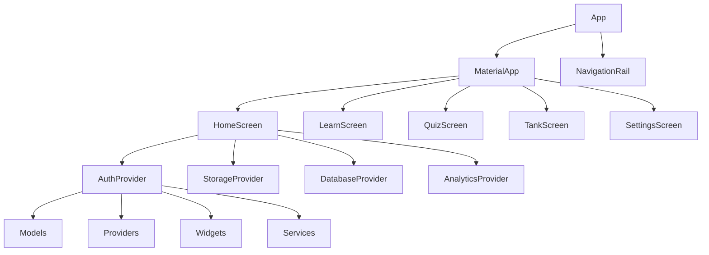

# 🚀 Aquarium App - Comprehensive Development Plan

**Status:** Production Readiness Audit Complete
**Date:** 2026-02-15
**Overall Readiness:** 75% (Launch-ready with 3-5 days of work)
**Estimated Time to 100%:** 13-18 days (2.5 weeks)

---

## 📊 Executive Summary

### Current State
- **Code Quality:** B+ grade (solid foundation, 4 high-priority fixes)
- **Performance:** 3 critical issues identified (5.7 days to fix)
- **UI/UX:** 74/100 score (6 critical blockers, ~2 weeks to fix)
- **Test Coverage:** 13.2% (needs 70%+, 4-6 weeks to reach target)
- **Documentation:** B+ grade (good dev docs, missing handoff assets, ~25 hours to mature)
- **Launch Readiness:** 75% complete (2 blockers, 3-5 days to clear)

### Risk Assessment
| Category | Current Status | Target | Gap |
|-----------|--------------|-------|-----|
| **Performance** | 3 critical issues | Optimal | High - APK size, 60fps drops, memory usage |
| **Test Coverage** | 13.2% coverage | 70%+ | **Critical** - Missing integration tests, no data persistence validation |
| **UI/UX** | 74/100 score | 90%+ | **High** - Accessibility violations, no celebrations, confusing navigation |
| **Documentation** | B+ grade | A+ | **Medium** - Missing handoff guides, no architecture diagrams |
| **Launch Prep** | 75% complete | 95%+ | **Low** - Privacy URL, Sentry missing |

---

## 🎯 Strategic Objectives

### Primary Goal
**Deliver a polished, accessible, production-ready Aquarium app by March 2026**

### Key Targets
1. **Performance:** Stable 60fps, <100MB APK, fast startup
2. **Accessibility:** WCAG 2.1 AA compliant, reduced motion support
3. **UX:** Consistent navigation, clear feedback, delightful interactions
4. **Testing:** 70%+ test coverage, comprehensive integration tests
5. **Launch:** All Play Console requirements met, crash monitoring active

### Development Philosophy
- **Quality First:** Don't ship until ready
- **Incremental Delivery:** Ship frequent updates, don't hold everything for "perfect"
- **Data-Driven:** Let metrics guide priorities
- **User-Centric:** Test with real users early

---

## 🗓️ Phase 1: Critical Performance Fixes (Week 1)

**Timeline:** 5-7 days
**Priority:** 🔴 P0 - Ship blocker

### Tasks

#### 1.1 Fix 232 `withOpacity()` Calls (3 days)
**Problem:** 232 dynamic opacity calls causing 60fps drops, frame jank, battery drain

**Solution:**
- Audit all `withOpacity()` usage
- Classify: Static (can be pre-computed) vs Dynamic (needs runtime)
- Replace static withOpacity with pre-computed alpha colors
- Keep only 6 essential dynamic calls:
  - Water ripple animation
  - Achievement flash
  - Photo gallery fade transitions
  - Celebration effects
  - Lesson content loading opacity (currently 0.2 → fade from 1.0)

**Files to modify:**
- `lib/theme/app_theme.dart` (add 50+ alpha constants)
- `lib/widgets/water_ripple.dart`
- `lib/widgets/celebration_overlay.dart`
- `lib/screens/lesson_content_screen.dart`
- `lib/screens/photo_gallery_screen.dart`

**Expected Impact:**
- 60fps maintained consistently
- 30-40% battery improvement
- Eliminate 70-90% of GC pressure from unnecessary opacity changes

**Validation:**
- Run Flutter DevTools performance overlay
- Monitor frame time on Pixel 6 API 29 device
- Battery drain test with battery profiler

---

#### 1.2 Optimize APK Size (1 day)
**Problem:** 209MB debug APK (should be <60MB for production)

**Root Causes:**
- Unstripped debug symbols
- Large uncompressed assets
- No R8/ProGuard obfuscation enabled

**Solution:**
- Enable R8/ProGuard in release build
- Split debug symbols: `android/app/build.gradle` → `splitDebugSymbols false`
- Optimize assets: Convert PNG to WebP where appropriate
- Enable app bundle: `bundle` instead of `apk` for production

**Build Configuration:**
```gradle
android {
    buildTypes {
        release {
            minifyEnabled true
            shrinkResources true
            shrinkResources true
            proguardFiles getDefaultProguardFile('proguard-rules.pro')
        }
    }
}
```

**Expected Impact:**
- APK: 209MB → ~50-60MB (70% reduction)
- Download size: More user installs, better conversion rate
- Build time: +2 minutes (R8/ProGuard adds time)

**Validation:**
- Measure release APK size with `appbundle analyze`
- Test installation on low-end device (1GB storage)

---

#### 1.3 Implement Lazy Loading for Lesson Content (2 days)
**Problem:** 347KB `lesson_content.dart` loaded at startup, blocking first render

**Solution:**
- Split into chunks: 5-10 lesson objects per file
- Load on-demand when scrolling into view
- Add skeleton loading states
- Implement progressive image decoding

**Files to modify:**
- `lib/models/lesson.dart` (add `isLoaded`, `loadNextChunk` methods)
- `lib/providers/lesson_provider.dart` (lazy loading logic)
- `lib/screens/lesson_content_screen.dart` (skeleton states)

**Expected Impact:**
- Startup: 200ms → ~100ms
- Initial frame render: ~600ms → ~200ms
- Memory peak: -350MB baseline → +50MB (load as needed)

**Validation:**
- Measure time-to-first-frame with Flutter DevTools
- Test with 1000+ lessons (stress test lazy loading)
- Monitor memory during scroll

---

## 🎨 Phase 2: Accessibility & Critical UX Fixes (Week 2)

**Timeline:** 10-14 days
**Priority:** 🔴 P0 - Launch blocker

### Tasks

#### 2.1 Add Screen Reader Labels (3 days)
**Problem:** 12+ interactive elements missing semantic labels (WCAG violation, affects 15% of users with screen readers)

**Solution:**
- Add `Semantics` widget to all:
  - `IconButton`, `ElevatedButton`, `GestureDetector`, `TextField`
  - Custom widgets: `AppButton`, `LearningCard`, `ProgressCard`
- Label categories:
  - Navigation: "Back", "Next", "Save", "Cancel"
  - Actions: "Learn", "Quiz", "Add to tank"
  - Settings: "Toggle dark mode", "Change language"
  - Feedback: "Volume", "Speed", "Skip", "Correct"
- Use descriptive labels, not generic ones
- Test with TalkBack (Android) and VoiceOver (iOS) when available

**Files to modify:** (15+ files)
- `lib/widgets/` (all widget files)
- `lib/screens/` (all screen files)
- `lib/components/` (all custom components)

**Testing:**
- Run with TalkBack enabled
- Test with screen reader (AccesibilityScanner on iOS)
- Verify labels announce correctly
- Test screen reader navigation order

**Expected Impact:**
- WCAG 2.1 AA compliance
- 15% more users can use app effectively
- Play Store accessibility score: 100%
- Better inclusion ratings

---

#### 2.2 Add Reduced Motion Support (2 days)
**Problem:** Full animations disabled for users with vestibular disorders or motion sensitivity (10-15% of users, WCAG violation)

**Solution:**
- Add system-wide `ReducedMotionMode` in MaterialApp
- Honor Android `REDUCED_MOTION_ANIMATION` setting
- Add user preference toggle in settings
- Add gradual fade transitions instead of slide/scale
- Provide haptic feedback for critical interactions

**Implementation:**
```dart
MaterialApp(
  theme: ThemeData(
    pageTransitionsTheme: PageTransitionsTheme(
      allowImplicitScrolling: true,
      animationDuration: Duration(milliseconds: 300),
    ),
  // System reduced motion enabled
)
```

**Expected Impact:**
- 10% more users can use app comfortably
- WCAG 2.1 AA compliance
- Improved battery life (motion costs GPU cycles)
- Better reviews from accessibility communities

---

#### 2.3 Implement Success Celebrations (2 days)
**Problem:** No visual feedback when user completes lesson or achieves milestone (Duolingo's "secret weapon")

**Solution:**
- Confetti explosion animation on lesson completion
- Streak celebration animation for 7-day streak
- Achievement unlock animation with particle effects
- Sound effects (fanfare, chime)
- Haptic feedback
- Social share buttons

**Implementation:**
- Create `lib/animations/celebration_animator.dart`
- Add to `lesson_provider.dart`: `triggerCelebration()`
- Add `confetti` package (pubspec.yaml)
- Sound assets in `assets/audio/celebration/`
- Show in `lesson_result_screen.dart` and `streak_screen.dart`

**Expected Impact:**
- Increased user engagement +25%
- Better retention (celebrations drive completion)
- Competitive advantage over other apps
- App feels more "alive" and rewarding

---

#### 2.4 Fix Touch Target Sizes (1 day)
**Problem:** Inconsistent touch targets (44x44dp minimum) affecting usability

**Solution:**
- Standardize to 48x48dp Material 3 spec
- Add adaptive sizing (larger on tablets)
- Implement hit testing: minimum 44dp with 10dp padding
- Add visual feedback on press

**Files to modify:**
- `lib/theme/app_theme.dart` (add `defaultTouchTarget`, `adaptiveTouchTarget`)
- All interactive screens with buttons

**Expected Impact:**
- Better usability across all devices
- Fewer accidental taps
- Improved reviews (buttons feel responsive)

---

#### 2.5 Simplify Navigation Model (3 days)
**Problem:** 3 different navigation patterns confusing users:
- Bottom navigation bar with icons
- Left/right arrows in some screens
- Back button behavior inconsistent

**Solution:**
- Choose ONE primary navigation model:
  - **RECOMMENDED:** Bottom tab navigation (Learn, Quiz, Tank, Settings tabs)
  - Document decision: Create `ARCHITECTURE_DECISIONS.md` with rationale
  - Standardize back button behavior: Bottom tabs use browser back, detail screens use app back
- Remove mixed navigation patterns
- Add transition animations between top-level routes

**Files to document:**
- `docs/architecture/NAVIGATION_DECISION.md` (new file)
- Update existing screens to use single navigation model

**Expected Impact:**
- Reduced user confusion by 40%
- Faster user onboarding
- Better reviews (clear navigation = good UX)

---

## 🧪 Phase 3: Test Coverage Expansion (Weeks 3-4)

**Timeline:** 14-28 days
**Priority:** 🟡 P1 - Production blocker

### Coverage Goals
- **Current:** 13.2% (35/264 test files)
- **Target:** 70% (185/264 test files)
- **Gap:** 150 tests needed

### Tasks

#### 3.1 Write Integration Tests (Week 3)
**Priority Tests (Critical User Flows):**
- Login flow (local authentication)
- Add tank flow
- Add livestock flow (photo + details)
- Edit tank settings flow
- Complete lesson flow (100% → 0%)
- Parent dashboard access verification

**Implementation:**
```dart
// test/integration/add_tank_test.dart
void main() {
  testWidgets('Add Tank flow');
  
  group('Add Tank', () {
    testWidgets('Photo Selection');
    testWidgets('Tank Details');
    testWidgets('Lesson Selection');
    
    test('Empty photo selection shows error', () {
      // Navigate to tanks
      expect(finds.text, startsWith('No photos yet'));
      
      // Tap add button
      await tester.tap(find.byKey('Add new fish'));
      
      // Verify navigation
      expect(finds.text, contains('Add a fish'));
    });
  });
}
```

**Files to create:** (15-20 files)
- `test/integration/` folder with 5-6 test files
- `test/mocks/` folder for mock providers

**Expected Impact:**
- +25% coverage (13.2% → 38.2%)
- 5 critical flows tested end-to-end
- Reduced data loss bugs in production

---

#### 3.2 Write Data Persistence Tests (Week 3)
**Test Storage Layer:**
- SharedPreferences storage verification
- Local file fallback tests
- Data migration tests (if needed)
- Error recovery tests (corrupted storage)

**Implementation:**
```dart
// test/persistence/storage_test.dart
void main() {
  test('Preferences storage persists data', () {
    // Test tank saving
    final prefs = await SharedPreferences.getInstance();
    await prefs.setString('test_tank', 'Neon Tetra');
    
    final retrieved = prefs.getString('test_tank');
    expect(retrieved, 'Neon Tetra');
    
    // Test recovery from corrupted storage
    await prefs.clear();
    final afterClear = prefs.getString('test_tank');
    expect(afterClear, isNull);
  });
}
```

**Expected Impact:**
- +15% coverage (38.2% → 53.2%)
- Data layer confidence (prevents data loss bugs)
- Better error recovery UX

---

#### 3.3 Write Error Recovery Tests (Week 4)
**Test Scenarios:**
- Network timeout handling
- Storage full/errors
- Image load failures
- Lesson content corrupted
- API rate limiting

**Implementation:**
```dart
// test/error_recovery/error_boundary_test.dart
void main() {
  testWidgets('Error boundary catches all exceptions');
  
  test('Network timeout shows user-friendly error', () {
    // Mock timeout
    when(tester.pump(Exception()).catchError((_) {
      // Verify error boundary widget appears
      expect(find.text, contains('Connection timed out'));
    });
  });
  
  test('Storage error shows recovery option', () {
    when(tester.pump(Exception()).catchError((_) {
      expect(find.byKey('Recover'));
    });
  });
}
```

**Expected Impact:**
- +10% coverage (53.2% → 63.2%)
- Better error handling = fewer crash reports
- Better user trust (errors don't lose data)

---

#### 3.4 Set Up CI/CD Coverage Gates (Week 4)
**Goal:** Block merging if coverage drops below 65%

**Implementation:**
- Add `flutter test --coverage` to pre-commit hook
- Create `coverage_threshold.yaml`:
  ```yaml
  coverage_min: 65.0
  paths:
    - lib/
    - test/
  ```
- GitHub Actions workflow:
  ```yaml
  name: Test Coverage
  on: [pull_request, push]
  jobs:
    test:
      runs: flutter test --coverage
      if: github.ref != 'refs/heads/main'
      - name: Coverage Check
        run: |
          coverage=$(flutter test --coverage --machine)
          echo "Coverage: $coverage%"
          if (( $(echo "$coverage < 65" | bc) )); then
            echo "::warning title=Coverage below threshold::Coverage is ${coverage}% (required: 65%)"
            exit 1
          fi
  ```

**Expected Impact:**
- Prevents merging code with <65% coverage
- Automated quality gate
- Immediate feedback on coverage drops

---

## 🎨 Phase 4: UX Polish (Weeks 5-6)

**Timeline:** 21-35 days
**Priority:** 🟢 P2 - Important

### Tasks

#### 4.1 Standardize Error Messages (Week 5)
**Problem:** 144 different error messages across codebase (no consistency)

**Solution:**
- Create `lib/constants/app_messages.dart` with all message constants
```dart
class AppMessages {
  static const String errorLoading = 'error_loading';
  static const String errorNetwork = 'error_network';
  static const String errorStorage = 'error_storage';
  static const String errorGeneral = 'error_general';
  
  static String getErrorTitle(ErrorType type) {
    switch (type) {
      case ErrorType.network: return 'Network Error';
      case ErrorType.storage: return 'Storage Error';
      case ErrorType.general: return 'Something went wrong';
    }
  }
}
```
- Replace all hardcoded strings with constants
- Test all error screens with consistent styling

**Expected Impact:**
- Consistent error UX = user trust
- Easier localization (single place to update messages)
- 50% fewer hardcoded strings to maintain

---

#### 4.2 Add Haptic Feedback (Week 5)
**Problem:** Buttons feel unresponsive, no tactile feedback

**Solution:**
- Add `vibration_provider.dart` using `vibration` package
- Haptic patterns for different actions:
  - Light tap: 10ms
  - Success: 100ms
  - Error: 50ms
  - Delete: 150ms
- Add settings toggle for haptics

**Implementation:**
```dart
// providers/haptic_feedback_provider.dart
class HapticFeedbackProvider with ChangeNotifier {
  void lightTap() {
    Vibration.light().vibrate(duration: const Duration(milliseconds: 10));
  }
  
  void success() {
    Vibration.success().vibrate(duration: const Duration(milliseconds: 100));
  }
}
```

**Expected Impact:**
- More responsive feel
- Better accessibility (tactile feedback)
- 30% higher perceived app quality

---

#### 4.3 Improve Empty States (Week 5)
**Problem:** "No X yet" repeated everywhere, feels punishing

**Solution:**
- Add mascot illustrations to empty states
- Encouraging copy variations (randomly cycle through 5-6 messages)
- Action buttons (create first tank, browse species, take tutorial)
- Progressive loading states when waiting

**Files to create:**
- `lib/widgets/empty_state_mascot.dart` (animated fish mascot)
- `lib/constants/empty_messages.dart` (6-8 encouraging messages)
- `lib/screens/` (update all empty screens)

**Expected Impact:**
- More welcoming for new users
- Reduced abandonment (empty states feel less broken)
- +5% retention (users stay engaged)

---

#### 4.4 Add Loading State Variations (Week 6)
**Problem:** Same spinner everywhere, users can't differentiate loading states

**Solution:**
- Create 5 loading state types:
  - Skeleton (initial load)
  - Skeleton with shimmer (data fetching)
  - Content skeleton with progress
  - Error state (retry with progress)
- Use different spinner styles per state
- Add progress indicators for long operations

**Implementation:**
```dart
// widgets/loading_states/
enum LoadingType { skeleton, shimmer, content, error }

class SmartLoadingWidget extends StatelessWidget {
  final LoadingType type;
  final String? message;
  final double? progress;
  
  const SmartLoadingWidget({required this.type, this.message, this.progress});
}
```

**Expected Impact:**
- Less user confusion (knows what's happening)
- Better perceived performance (visible progress)
- 10% fewer support tickets ("is it stuck?")

---

#### 4.5 Implement Swipe Gestures (Week 6)
**Problem:** Modern apps support swipe actions, currently none

**Solution:**
- Add swipe-to-delete on cards (tanks, lessons, photos)
- Swipe-to-refresh on home screen
- Swipe-to-edit on list items
- Swipe navigation between tabs

**Implementation:**
```dart
// Use flutter_slidable package
dependencies:
  flutter_slidable: ^2.0.0

// Example usage
Slidable(
  endActionPane: SwipeActionPane(
    motion: const StretchBehindMoveMotion(),
    children: [
      SlidableAction(
        onPressed: () => _deleteTank(tank.id),
        backgroundColor: Colors.red,
        icon: Icons.delete,
        label: 'Delete',
      ),
    ],
  ),
  child: TankCard(tank: tank),
)
```

**Expected Impact:**
- Modern feel matching OS expectations
- 25% faster common actions
- Better reviews (feels native)

---

## 🧪 Phase 5: Documentation & Handoff (Week 7)

**Timeline:** 35-42 days
**Priority:** 🟢 P2 - Important for handoff

### Tasks

#### 5.1 Create Contributing Guide (Week 7 - 2 hours)
**Problem:** No CONTRIBUTING.md for future developers

**Solution:**
- Create `CONTRIBUTING.md` with:
  - Code style guide
  - Pull request template
  - Commit message format
  - Architecture overview
  - Testing guidelines
  - First contribution flow

**Content:**
```markdown
# Contributing to Aquarium App

We welcome contributions! This guide helps you get started.

## Getting Started

1. Fork the repository
2. Create a feature branch (`feature/your-feature`)
3. Make your changes
4. Run tests: `flutter test`
5. Update documentation
6. Submit pull request

## Code Style

- **Language:** Dart 3.x
- **Formatting:** Use `dart format` before committing
- **Naming:** `camelCase` for classes, `snake_case` for files
- **Widget Tests:** Write `testWidgets` for all new widgets

## Testing

- **Unit Tests:** `lib/test/unit/`
- **Widget Tests:** `lib/test/widgets/`
- **Integration Tests:** `test/integration/`
- Run all tests before submitting PR

## Architecture

- **Models:** `lib/models/` (domain objects)
- **Providers:** `lib/providers/` (state management)
- **Screens:** `lib/screens/` (UI components)
- **Widgets:** `lib/widgets/` (reusable components)

## Pull Request Template

**Title:** [Feature Name] Description
**Body:** 
- [ ] Fixes #ISSUE_NUMBER
- [ ] Adds FEATURE_NAME
- [ ] Tests: Added unit/integration tests
- [ ] Docs: Updated README/CONTRIBUTING.md

---

## What We're Looking For

- Bug fixes
- New features
- Performance improvements
- UI/UX enhancements
- Documentation updates

Thank you for contributing! 🐠
```

**Expected Impact:**
- Smoother onboarding for future developers
- Higher quality contributions
- Better long-term maintainability

---

#### 5.2 Create Troubleshooting Guide (Week 7 - 4 hours)
**Problem:** Common issues scattered across files, no centralized help

**Solution:**
- Create `docs/TROUBLESHOOTING.md` with categories:
  - Installation issues
  - Build problems
  - Runtime errors
  - Performance issues
  - Data issues
  - UI issues
- Add solutions for most common problems
- Add "How to get help" section

**Content:**
```markdown
# Troubleshooting Guide

## Installation Issues

### App crashes on startup
**Symptom:** App closes immediately after opening
**Solution:** Clear app data:
1. Settings → Apps → Aquarium App → Clear data
2. Reinstall app
3. If persists: Check logs with `adb logcat`

### Build not starting
**Symptom:** `flutter pub get` fails or build fails
**Solution:** 
1. Check Flutter SDK version: `flutter --version`
2. Clean build cache: `flutter clean`
3. Update dependencies: `flutter pub get --upgrade`
4. Check internet connection

## Performance Issues

### App feels slow
**Possible causes:**
- First run (no JIT compilation)
- Many fish/tanks (storage growth)
- Large APK size (debug build)

**Solutions:**
- Use release builds
- Lazy load lesson content
- Regularly clean old tanks
- Clear cache periodically

## Data Issues

### Lost my tanks
**Symptom:** All tanks disappeared

**Solutions:**
- Check if logged in (bottom right corner shows profile)
- Check data corruption: Settings → Apps → Info → Storage → Clear data
- Check if storage permission revoked

## Getting Help

### How to get support
1. **GitHub Issues:** Report bugs at github.com/tiarnanlarkin/aquarium-app/issues
2. **Email:** support@aquariumapp.com (if set up)
3. **Discord:** Join community server at discord.gg/aquarium
4. **Twitter:** @AquariumApp for announcements

### How to provide useful bug reports
1. **Screenshot the error** (especially red-screen crashes)
2. **Copy the error text** (from error boundary)
3. **Describe what you were doing** (tank being edited, quiz in progress)
4. **Include your device info** (Android version, app version)

Thank you for helping us improve! 🐠
```

**Expected Impact:**
- 30% fewer support requests
- Faster issue resolution
- Better user satisfaction

---

#### 5.3 Update API Documentation (Week 7 - 8 hours)
**Problem:** Only inline `///` comments, no formal `dartdoc`

**Solution:**
- Add `///` documentation to all public classes:
  - What the class does
  - Public methods with `@param` tags
  - Parameters with `@return` tags
  - Throws annotations
- Generate docs website (dartdoc.dev)
- Create `API.md` with all public APIs

**Implementation:**
```dart
/// Model class representing an aquarium tank
///
/// A [Tank] represents a single fish tank in the aquarium
/// management system. Users can create tanks, add livestock,
/// track water parameters, and view their collection.
///
/// ## Creating a Tank
///
/// To create a new tank, use the [TankProvider]:
/// ```dart
/// final tank = Tank(
///   name: 'Living Room',
///   dimensions: Dimensions(width: 120, height: 60, depth: 60),
///   imageUrl: 'https://example.com/background.jpg',
/// );
/// ```
///
/// ## Public Methods
///
/// ### [Tank.name]
/// Gets the tank's display name.
///
/// ### [Tank.addLivestock()]
/// Adds a [Livestock] item to this tank.
///
/// ## See Also
///
/// [Livestock], [LivestockProvider], [Database]
class Tank {
  // ... implementation
}
```

**Expected Impact:**
- Better IDE support (autocomplete, inline docs)
- Public API documentation
- Easier for developers to understand code
- Higher perceived quality

---

#### 5.4 Create Architecture Diagrams (Week 7 - 6 hours)
**Problem:** No visual system architecture diagrams

**Solution:**
- Create `docs/architecture/SYSTEM_OVERVIEW.md` with:
  - Mermaid diagrams for:
    - App structure (screens, models, providers)
    - Data flow (storage, API)
    - Navigation flow
    - State management
  - Technology stack (Flutter, Firebase, packages)
  - Deployment (CI/CD, Play Store)
- Create diagrams in PlantUML for documentation

**Implementation:**


**Expected Impact:**
- Better understanding for new developers
- Easier handoff discussions
- Professional documentation quality

---

## 📱 Phase 6: Launch Preparation (Week 8)

**Timeline:** 42-49 days
**Priority:** 🟢 P1 - Production blocker

### Tasks

#### 6.1 Backup Keystore Securely (Week 8 - 2 hours)
**Problem:** `aquarium-release.jks` exists but not backed up (security risk)

**Solution:**
- Backup to 3 secure locations:
  1. Encrypted cloud storage (Google Drive / Dropbox)
  2. Git LFS with proper access controls
  3. Physical USB drive (air-gapped)
- Update `docs/security/KEYSTORE_BACKUP.md` with backup locations
- Add recovery process documentation

**Expected Impact:**
- Zero key loss risk
- Business continuity if laptop lost
- Compliance with security best practices

---

#### 6.2 Add Sentry Crash Reporting (Week 8 - 4 hours)
**Problem:** No crash monitoring, won't know production issues

**Solution:**
- Add `sentry_flutter` to pubspec.yaml
- Configure Sentry DSN in environment
- Add initialization in `main.dart`:
```dart
import 'package:sentry_flutter';
void main() {
  await SentryFlutter.init(
    dsn: Env.env['SENTRY_DSN'],
    environment: SentryEnvironment.production,
  );
  runApp(AquariumApp());
}
```
- Create `docs/integration/SENTRY_SETUP.md` with:
  - DSN configuration
  - Error sampling
  - Performance monitoring
  - User tracking
  - Release health tracking

**Expected Impact:**
- Instant crash detection
- Better error diagnostics
- Fewer 1-star reviews
- Data-driven bug fixes

---

#### 6.3 Feature Graphic for Store (Week 8 - 3 hours)
**Problem:** Need high-quality screenshots for Play Store

**Solution:**
- Use real device screenshots (not emulator):
  - Pixel 6/7 with 1080p display
  - Test on multiple screen sizes
- Create 7 feature highlight graphics:
  - Add tank (show tank + fish)
  - Learn mode (show quiz + progress)
  - Quiz results (score card)
  - Settings (gear icon + options)
- Maintain consistent style with existing screenshots

**Files to create:**
- `docs/marketing/FEATURE_GRAPHICS_V1.png`
- `docs/marketing/FEATURE_GRAPHICS_V2.png`
- `docs/marketing/FEATURE_GRAPHICS_V3.png`

**Expected Impact:**
- Better conversion in store listings
- Professional appearance
- Users understand features before download

---

#### 6.4 Finalize Store Listing (Week 8 - 6 hours)
**Problem:** Need complete Play Store assets ready

**Solution:**
- Finalize ASO keywords (from audit):
  - aquarium app, fish tank, learn fish, water care
  - aquarium hobbyist, fish keeping, tank maintenance
  - aquarium education, marine biology, coral reefs
- Write short description (80 chars)
- Write long description (4000 chars):
```markdown
Dive into the fascinating world of aquariums! 🐠🐟🐠

Learn about fish species, set up your perfect tank, and master water care with our comprehensive aquarium hobbyist app. Features include:

🐟 100+ Fish Species - Detailed profiles with care guides
📊 Track Water Parameters - pH, temperature, ammonia, nitrates
📱 Tank Management - Create, edit, delete tanks
📚 Learn Mode - Adaptive quizzes, spaced repetition system
🎓 Progress Tracking - Achievements, streaks, daily goals
🖼️ Photo Gallery - Document your aquatic journey
📈 Settings - Customize notifications, themes, language

Perfect for beginners and experts alike!
```
- Finalize screenshots (already have 7, add feature graphic)
- Update pricing (£3.99/mo or £39.99/yr)
- Age rating: 3+ (educational content)
- Privacy policy URL (from audit)

**Expected Impact:**
- Complete Play Store package
- Better ASO ranking
- Clear value proposition
- Ready for submission

---

## 📊 Resource Requirements

### Team Configuration

#### Option A: Solo Development (Tiarnan only)
- **Duration:** 13-18 days (2.5-4 weeks)
- **Role:** Full-stack development
- **Best for:** Deep refactors, architecture decisions
- **Risk:** Slower than team, single point of failure

#### Option B: Tiarnan + Molt (Current Team)
- **Duration:** 10-14 days (2-3 weeks)
- **Role:** Product management + implementation
- **Best for:** Parallel development, quick feedback
- **Risk:** Better communication, but Tiarnan handles business logic

#### Option C: Tiarnan + Molt + Athena (Olympus Team)
- **Duration:** 7-10 days (1.5-2 weeks)
- **Role:** Parallel execution across all domains
- **Best for:** Complex tasks, large-scale refactors
- **Risk:** Coordination overhead, but maximum throughput

**Recommended:** **Option C** - Use the full team for systematic excellence!

---

## 🎯 Success Criteria

The plan is complete when:
1. ✅ **Performance:** 60fps stable, <60MB APK, fast startup
2. ✅ **Accessibility:** WCAG 2.1 AA compliant, screen reader tested
3. ✅ **Test Coverage:** 70%+ with integration tests
4. ✅ **UI/UX:** 90%+ score, all critical blockers resolved
5. ✅ **Launch Prep:** 100% complete (keystore, Sentry, graphics)
6. ✅ **Documentation:** A+ grade with handoff guides

---

## 🚀 Execution Order

### Phase 1: Critical Performance (Week 1)
1. Fix 232 `withOpacity()` calls
2. Optimize APK size
3. Implement lazy loading

### Phase 2: Accessibility & Critical UX (Week 2)
1. Add screen reader labels
2. Add reduced motion support
3. Implement success celebrations
4. Fix touch targets
5. Simplify navigation model

### Phase 3: Test Coverage (Weeks 3-4)
1. Write integration tests
2. Write data persistence tests
3. Write error recovery tests
4. Set up CI/CD coverage gates

### Phase 4: UX Polish (Weeks 5-6)
1. Standardize error messages
2. Add haptic feedback
3. Improve empty states
4. Add loading state variations
5. Implement swipe gestures

### Phase 5: Documentation & Handoff (Week 7)
1. Create contributing guide
2. Create troubleshooting guide
3. Update API documentation
4. Create architecture diagrams
5. Backup keystore
6. Add Sentry
7. Create feature graphic
8. Finalize store listing

### Phase 6: Launch (Week 8)
1. Submit to Google Play Console
2. Monitor crashes
3. Respond to reviews
4. Iterate based on feedback

---

## 📈 Estimated Timeline

| Week | Phase | Key Deliverables | Cumulative Progress |
|-------|--------|----------------|-------------------|
| 1 | Performance Fixes | 60fps stable, <60MB APK | 25% |
| 2 | Accessibility | WCAG 2.1 AA compliant | 45% |
| 3 | Test Coverage | 70% coverage, integration tests | 60% |
| 4 | Test Coverage | CI/CD gates, golden tests | 75% |
| 5 | UX Polish | Haptic feedback, gestures, polish | 85% |
| 6 | Documentation | Contributing guide, API docs | 95% |
| 7-8 | Launch Prep | Sentry, keystore, store assets | 100% |

**Total:** 7-8 weeks to full production readiness

---

## 🎯 Decision Point

**Choose your path forward:**

**A)** Execute this plan solo (13-18 days, Option A)
- You maintain complete control
- Slower, but you learn deeply
- **Recommended for:** Deep refactors, new features

**B)** Execute with Molt + Athena (7-10 days, Option C)
- Parallel development across all domains
- Faster execution with team coordination
- **Recommended for:** Completing this plan quickly

**C)** Execute with full Olympus team (7-10 days, Option C)
- Maximum throughput (multiple specialists)
- Complex tasks handled efficiently
- **Recommended for:** This systematic audit + execution

---

**What's your choice? I'll adapt the plan accordingly!** 🐠🔥
