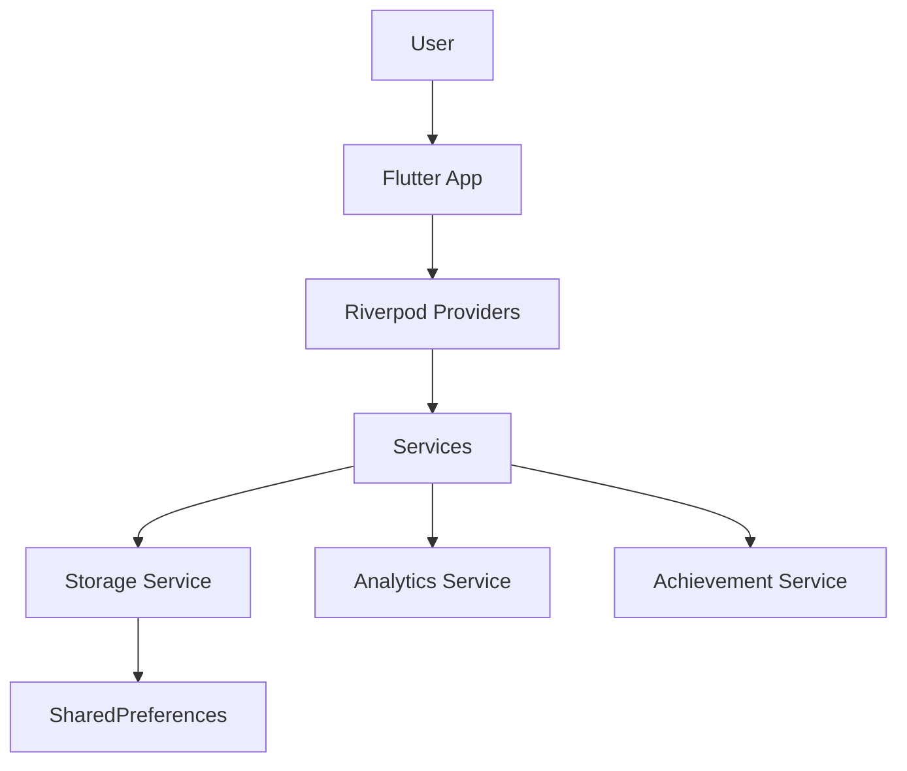

# 📚 Documentation & Maintainability Audit

**Project:** Aquarium Hobby App  
**Audit Date:** 2026-02-15  
**Auditor:** Subagent (Documentation Review)  
**Scope:** `/mnt/c/Users/larki/Documents/Aquarium App Dev/repo/`

---

## Executive Summary

### Overall Grade: **B-** (Good Foundation, Needs Enhancement)

The Aquarium App has **extensive development documentation** but lacks **critical maintainability assets** for handoff and long-term sustainability. The project excels in planning, testing, and build documentation but needs formal API docs, troubleshooting guides, and contributor onboarding.

### Strengths ✅
- Comprehensive planning documentation (roadmaps, PRDs, market research)
- Detailed build and deployment guides
- Well-maintained changelog following semantic versioning
- Extensive test reports and audit documentation
- Clear git workflow documentation
- Legal compliance (privacy policy, terms of service)

### Critical Gaps 🔴
- **No CONTRIBUTING.md** — New developers have no contribution guidelines
- **No TROUBLESHOOTING.md** — Common issues not centralized
- **No formal API documentation** — Code lacks dartdoc parameter tags
- **No architecture diagrams** — ASCII art exists but no visual diagrams
- **Incomplete user documentation** — Feature guides missing for end users

### Metrics

| Category | Status | Score |
|----------|--------|-------|
| **Code Documentation** | Basic inline comments | 5/10 |
| **README Completeness** | Good but technical-focused | 7/10 |
| **Architecture Docs** | Text diagrams only | 4/10 |
| **User Guides** | Partial (developer-focused) | 5/10 |
| **Changelog** | Excellent | 10/10 |
| **Contributing Guide** | Missing | 0/10 |
| **Troubleshooting** | Scattered across files | 3/10 |
| **Build Process** | Well documented | 9/10 |
| **Testing Docs** | Comprehensive | 8/10 |
| **Legal Compliance** | Complete | 10/10 |

**Overall Documentation Score: 61/100 (C+)**

---

## 1. Code Documentation Analysis

### Current State

**Dart Files:** 264  
**Lines with dartdoc (///):** 2,418  
**Lines with @param/@returns/@throws:** 0

#### ✅ What Exists
- Basic dartdoc-style comments (`///`) on most public classes and methods
- Inline comments explaining complex logic
- Some services have good high-level descriptions

**Example (Good):**
```dart
/// Service for aggregating user analytics and generating AI-like insights.
///
/// Provides comprehensive progress analysis including:
/// - Daily and weekly XP trends
/// - Topic performance tracking
/// - Learning time pattern detection
/// - Predictive milestones and recommendations
class AnalyticsService {
  /// Generate complete analytics summary for a user
  static AnalyticsSummary generateSummary({...}) {...}
}
```

#### ❌ What's Missing
- **No @param tags** — Parameter descriptions missing
- **No @returns tags** — Return value documentation missing
- **No @throws tags** — Exception documentation missing
- **No dartdoc generation setup** — No API documentation website
- **Inconsistent coverage** — Some files well-documented, others sparse

**Example (Needs Improvement):**
```dart
/// Gems state combining balance and transaction history
class GemsState {
  final int balance;
  final List<GemTransaction> transactions;
  final DateTime lastUpdated;
  // Missing: @param documentation for constructor parameters
}
```

### Recommendations

#### Priority 1: Add Formal Dartdoc Tags (6-8 hours)
1. **High-value targets** (public APIs used across app):
   - `lib/services/` — All service methods
   - `lib/providers/` — All provider classes
   - `lib/models/` — All model constructors and methods
   - `lib/widgets/` — Reusable widget components

2. **Template to follow:**
```dart
/// Brief description of what the method does.
///
/// More detailed explanation if needed, including:
/// - When to use this
/// - What it returns
/// - Any side effects
///
/// Example:
/// ```dart
/// final summary = AnalyticsService.generateSummary(
///   profile: userProfile,
///   allPaths: learningPaths,
/// );
/// ```
///
/// @param profile The user profile to analyze
/// @param allPaths All available learning paths for context
/// @param timeRange Optional time range filter (defaults to allTime)
/// @returns A complete analytics summary with insights and predictions
/// @throws StateError if profile has no completed lessons
static AnalyticsSummary generateSummary({...}) {...}
```

#### Priority 2: Generate API Documentation (2 hours)
1. **Set up dartdoc generation:**
   ```bash
   # Add to pubspec.yaml dev_dependencies
   dev_dependencies:
     dartdoc: ^8.0.0
   
   # Generate docs
   dart doc .
   
   # Serve locally
   dhttpd --path doc/api
   ```

2. **Add script to package.json or docs/scripts/**:
   ```bash
   #!/bin/bash
   # generate_api_docs.sh
   cd apps/aquarium_app
   dart doc --output=../../docs/api
   echo "API docs generated at docs/api/index.html"
   ```

3. **Host on GitHub Pages or include in repo**:
   - Option A: Commit `docs/api/` to repo
   - Option B: Use GitHub Actions to auto-generate and deploy

#### Priority 3: Document Complex Logic (3-4 hours)
Add detailed explanations for:
- **Spaced repetition algorithm** (`lib/services/review_queue_service.dart`)
- **Hearts refill calculation** (`lib/services/hearts_service.dart`)
- **XP and level-up formulas** (`lib/models/user_profile.dart`)
- **Gem economy trigger logic** (`lib/providers/gems_provider.dart`)
- **Achievement unlock conditions** (`lib/services/achievement_service.dart`)

---

## 2. README Completeness

### Root README (`/repo/README.md`)

**Current State:** 1,830 bytes — Very brief, focuses on file organization rules

#### ✅ Strengths
- Clear workspace organization guidelines
- Explains git workflow
- Enforces "all files in repo" rule

#### ❌ Gaps
- **No project overview** — What is this app?
- **No quick start** — How to run the app?
- **No links to documentation** — Where to find guides?
- **Too focused on rules** — Reads like internal policy, not project README

### App README (`/apps/aquarium_app/README.md`)

**Current State:** 5,609 bytes — Comprehensive and well-structured

#### ✅ Strengths
- Feature list with emojis (engaging)
- Tech stack table
- Installation instructions
- Build commands
- Project structure overview
- Roadmap status
- Screenshots placeholders
- Acknowledgments

#### ❌ Gaps
- **Screenshots are placeholders** — No actual images
- **No troubleshooting section** — "Won't build" / "Dependency errors"
- **No FAQ** — Common questions unanswered
- **No contributor section** — How to contribute?
- **Dependencies version table missing** — What Flutter/Dart versions required?

### Recommendations

#### Priority 1: Update Root README (30 min)
Transform from "policy doc" into proper project README:

```markdown
# 🐠 Aquarium Hobby App - Development Repository

Your Personal Aquarium Companion — Learn, Track, Thrive

A beautiful, gamified mobile app for aquarium hobbyists. Track tanks, learn the hobby, and level up your skills with Duolingo-style engagement.

## Quick Links
- [App README](apps/aquarium_app/README.md) — Main project documentation
- [Developer Setup](docs/setup/DEVELOPER_SETUP.md) — Get started developing
- [Architecture](docs/ARCHITECTURE.md) — System design overview
- [Contributing](CONTRIBUTING.md) — How to contribute
- [Changelog](CHANGELOG.md) — Version history

## Repository Structure
```
repo/
├── apps/aquarium_app/     ← Flutter app source code
├── docs/                  ← All documentation
│   ├── planning/          ← Roadmaps, PRDs
│   ├── guides/            ← Developer guides
│   ├── testing/           ← Test reports
│   ├── legal/             ← Privacy, terms
│   └── audit/             ← Audit reports
├── scripts/               ← Build and automation scripts
└── contracts/             ← Data contracts (future backend)
```

## Getting Started

### Prerequisites
- Flutter 3.10+
- Dart 3.10+
- Android Studio or VS Code

### Run the App
```bash
cd apps/aquarium_app
flutter pub get
flutter run
```

See [apps/aquarium_app/README.md](apps/aquarium_app/README.md) for full setup.

## Project Status
- **Phase:** Phase 3 (Quality & Polish)
- **Version:** 0.1.0 (MVP)
- **Test Coverage:** 98%+ (435+ tests)
- **Next Milestone:** Production release

## License
Proprietary - All rights reserved
```

#### Priority 2: Enhance App README (1 hour)
1. **Add actual screenshots** (from `docs/testing/screenshots/`)
2. **Add troubleshooting section**:
   ```markdown
   ## Troubleshooting
   
   ### Build Errors
   **Problem:** "Could not resolve all files for configuration"  
   **Solution:** Run `flutter clean && flutter pub get`
   
   **Problem:** "Gradle sync failed"  
   **Solution:** Check that Android SDK path is correct in `local.properties`
   
   See [TROUBLESHOOTING.md](../../docs/TROUBLESHOOTING.md) for more.
   ```

3. **Add FAQ section**:
   ```markdown
   ## FAQ
   
   **Q: What Flutter version is required?**  
   A: Flutter 3.10+ and Dart 3.10+
   
   **Q: Does this work on iOS?**  
   A: Not yet — Android only for MVP
   
   **Q: How do I run tests?**  
   A: `flutter test` or see [docs/testing/WIDGET_TEST_GUIDE.md]
   
   **Q: Where are the screenshots?**  
   A: Build and run the app, or see `docs/testing/screenshots/`
   ```

4. **Add dependency version table**:
   ```markdown
   ## Dependencies
   
   | Dependency | Version | Purpose |
   |------------|---------|---------|
   | Flutter | 3.10+ | Framework |
   | Riverpod | 2.6.1 | State management |
   | GoRouter | 14.6.2 | Navigation |
   | FL Chart | 0.70.3 | Data visualization |
   | Shared Preferences | 2.3.4 | Local storage |
   ```

---

## 3. Architecture Documentation

### Current State

#### ✅ What Exists
- **ARCHITECTURE_DIAGRAM.txt** — Detailed ASCII art diagram of exercise system
- **DECISIONS.md** — Key architectural decisions documented
- **File organization** — Clear structure (`models/`, `providers/`, `services/`, `screens/`)

**Example (ARCHITECTURE_DIAGRAM.txt):**
```
┌─────────────────────────────────────────────────────────────────┐
│                   EnhancedQuizScreen                            │
│  ┌──────────────────────────────────────────────────────────┐   │
│  │  📊 Progress Header                                      │   │
│  │  • Question counter (1 of 5)                             │   │
│  │  • Score tracker (3 correct)                             │   │
│  │  • Animated progress bar                                 │   │
│  └──────────────────────────────────────────────────────────┘   │
...
```

#### ❌ What's Missing
- **No visual architecture diagrams** — No PNG/SVG diagrams
- **No system overview diagram** — How do all the pieces fit?
- **No data flow diagrams** — How does state flow through the app?
- **No component dependency graph** — What depends on what?
- **No deployment architecture** — How does the app interact with services?

### Recommendations

#### Priority 1: Create ARCHITECTURE.md (4-6 hours)

**Structure:**
```markdown
# Architecture Overview

## System Architecture

### High-Level Design
[Include diagram: App → Services → Storage → External APIs]

### Technology Stack
- **Framework:** Flutter 3.10
- **State Management:** Riverpod 2.6
- **Navigation:** GoRouter
- **Storage:** SharedPreferences (local-only MVP)
- **Future:** Supabase backend (Phase 4)

### Architectural Patterns
- **Clean Architecture** — Separation of concerns
- **Provider Pattern** — State management
- **Service Layer** — Business logic isolation
- **Repository Pattern** — (Future backend integration)

## Module Structure

### Core Modules
1. **Learning System**
   - Models: `Lesson`, `LearningPath`, `Exercise`
   - Providers: `userProfileProvider`, `spacedRepetitionProvider`
   - Services: `review_queue_service`, `difficulty_service`
   - Screens: `learn_screen`, `enhanced_quiz_screen`

2. **Gamification System**
   - Models: `UserProfile`, `Achievement`, `ShopItem`
   - Providers: `gemsProvider`, `heartsProvider`, `achievementProvider`
   - Services: `achievement_service`, `hearts_service`, `shop_service`
   - Screens: `home_screen`, `shop_screen`, `achievements_screen`

3. **Tank Management**
   - Models: `Tank`, `Livestock`, `Equipment`, `LogEntry`
   - Providers: `tankProvider`
   - Screens: `tank_detail_screen`, `livestock_screen`

[Continue for all modules...]

## Data Flow

### Example: Completing a Lesson
```
User completes lesson
  ↓
EnhancedQuizScreen validates answers
  ↓
Calls userProfileProvider.completeLesson(lessonId)
  ↓
Provider updates:
  - completedLessons list
  - totalXp (+50)
  - currentStreak
  ↓
Triggers side effects:
  - GemsProvider.awardGems("lesson_complete", 5)
  - AchievementService.checkAfterLesson()
  - SpacedRepetitionProvider.scheduleReview()
  - CelebrationService.showConfetti()
  ↓
UI updates reactively via Riverpod
```

## Service Layer

### Core Services
| Service | Responsibility | Dependencies |
|---------|----------------|--------------|
| `achievement_service.dart` | Check and unlock achievements | `user_profile`, `storage` |
| `hearts_service.dart` | Hearts refill logic | `user_profile`, `storage` |
| `review_queue_service.dart` | Spaced repetition scheduling | `spaced_repetition` model |
| `analytics_service.dart` | Stats aggregation | `user_profile`, `learning` |

[Continue for all services...]

## State Management

### Riverpod Provider Hierarchy
```
ConsumerWidget (Screen)
  ↓ watches
Provider (State)
  ↓ reads/writes
Storage Service
  ↓ persists to
SharedPreferences
```

### Key Providers
- `userProfileProvider` — User profile and XP
- `tankProvider` — Tank list management
- `gemsProvider` — Gem balance and transactions
- `heartsProvider` — Hearts system
- `spacedRepetitionProvider` — Review queue

## Navigation

### Route Structure
```
HouseNavigator (Root)
  ├── HomeScreen (Living Room)
  ├── LearnScreen (Study Room)
  ├── WorkshopScreen (Workshop)
  ├── SettingsScreen (Settings)
  └── [Other rooms...]
```

### Deep Linking (Future)
- `/tanks/:id` — Direct to tank detail
- `/lessons/:id` — Direct to lesson
- `/shop` — Direct to shop

## Storage Architecture

### Current (MVP - Local Only)
- **SharedPreferences** — All data stored locally
- **JSON serialization** — Models have toJson/fromJson
- **No cloud sync** — Single device only

### Future (Phase 4 - Backend)
- **Supabase** — PostgreSQL backend
- **Row Level Security** — User data isolation
- **Real-time sync** — Cross-device updates
- **Cloud storage** — Photos and backups

## Testing Strategy

### Test Pyramid
```
      E2E Tests
     (Planned)
    /          \
   /  Widget    \
  /   Tests      \
 /   (Starting)   \
/_________________ \
  Unit Tests (98%)
```

- **Unit Tests:** 435+ tests, 98% coverage
- **Widget Tests:** Infrastructure ready, tests needed
- **Integration Tests:** Planned for critical flows

## Performance Considerations

### Known Performance Items
- Replace `.withOpacity()` with pre-computed colors
- Use `ListView.builder` for all lists
- Lazy load images with `cached_network_image`
- Minimize widget rebuilds via `const` constructors

See [docs/performance/](../performance/) for details.

## Security Considerations

### Current (MVP)
- No authentication — single device
- Data stored in app sandbox
- No network calls (offline-first)

### Future (Backend Integration)
- Supabase Auth (email, Google, Apple)
- JWT tokens for API calls
- Row-level security policies
- HTTPS only

## Scalability Path

### MVP → Phase 4
1. Add authentication layer
2. Migrate storage to Supabase
3. Implement conflict resolution
4. Add photo cloud storage
5. Enable multi-device sync

See [MASTER_INTEGRATION_ROADMAP.md](../../MASTER_INTEGRATION_ROADMAP.md).
```

#### Priority 2: Create Visual Diagrams (3-4 hours)

Use tools like:
- **draw.io** (free, exports to PNG/SVG)
- **Mermaid** (markdown-based, renders in GitHub)
- **PlantUML** (code-based, good for system diagrams)

**Diagrams to create:**
1. **System Architecture Diagram** — High-level overview
2. **Module Dependency Graph** — Which modules depend on what
3. **Data Flow Diagram** — How data moves through the system
4. **State Management Diagram** — Provider hierarchy
5. **Navigation Flow** — User journey through app

**Example (Mermaid in markdown):**
```markdown
## System Architecture



Store diagrams in `docs/architecture/diagrams/`.

---

## 4. Feature Documentation

### Current State

#### ✅ What Exists (Developer-Focused)
- **Build guides** — Release build, debug build, deployment
- **Testing guides** — Widget tests, E2E testing
- **Error handling guide** — Error boundary implementation
- **Firebase setup** — Analytics and Crashlytics
- **Play Store submission** — Complete launch guide

#### ❌ What's Missing (User-Focused)
- **Feature guides for end users** — How to use the app
- **Admin/creator docs** — How to add new species, lessons, etc.
- **Onboarding tutorial** — In-app help documentation
- **Video tutorials** — Screencast walkthroughs

### Recommendations

#### Priority 1: Create User Guides (6-8 hours)

**Structure:** `docs/user-guides/`

1. **GETTING_STARTED.md** — First-time user guide
   - Creating your first tank
   - Taking the placement test
   - Understanding XP, gems, and hearts
   - Setting daily goals

2. **LEARNING_SYSTEM.md** — How to use lessons
   - Navigating the learning path
   - Taking quizzes
   - Understanding difficulty levels
   - Using hints and hearts
   - Reviewing with spaced repetition

3. **TANK_MANAGEMENT.md** — Managing your aquariums
   - Adding tanks, livestock, plants
   - Logging water parameters
   - Tracking maintenance tasks
   - Using the photo gallery
   - Analyzing trends

4. **GAMIFICATION.md** — Understanding game mechanics
   - XP and leveling system
   - Earning and spending gems
   - Heart system and refills
   - Building streaks
   - Unlocking achievements
   - Shopping for power-ups

5. **TOOLS_AND_CALCULATORS.md** — Using the workshop
   - Tank volume calculator
   - Stocking calculator
   - Water change calculator
   - Dosing calculator
   - CO₂ calculator
   - Unit converter

6. **SPECIES_DATABASE.md** — Researching fish and plants
   - Browsing the species catalog
   - Filtering by care level
   - Understanding compatibility
   - Reading care requirements

#### Priority 2: Create Content Creator Docs (4 hours)

For future developers who need to add content:

**CONTENT_CREATION_GUIDE.md** (already exists, enhance it)
- How to add new fish species
- How to add new plants
- How to create new lessons
- How to write quiz questions
- How to define achievements
- How to add shop items

---

## 5. Changelog

### Current State: **Excellent ✅**

**File:** `CHANGELOG.md` (5,814 bytes)

#### ✅ Strengths
- Follows [Keep a Changelog](https://keepachangelog.com/) format
- Adheres to [Semantic Versioning](https://semver.org/)
- Comprehensive phase-by-phase breakdown
- Clear categorization: Added / Fixed / Changed / Removed
- Version history table
- Links to related documentation

**Example:**
```markdown
## [0.1.0] - 2026-02-12 (MVP)

### Added
#### Phase 1: Gamification Integration (2026-02-11)
- **Gem Earning System** — Automatic gem rewards for 14 trigger events
...

### Fixed
#### Critical Fixes (Phase 3 Sprint 3.2)
- **GemsProvider race condition** — Fixed initialization issue
...

## Version History
| Version | Date | Phase | Status |
|---------|------|-------|--------|
| 0.1.0 | 2026-02-12 | MVP (Phases 0-3) | 🚧 In Progress |
```

#### ❌ Minor Gaps
- **No "Deprecated" section** — Not relevant yet (MVP)
- **No "Security" section** — Add if security fixes occur

### Recommendations

#### Continue Current Practices ✅
- Keep updating changelog with every release
- Maintain the phase-based structure
- Link to detailed implementation docs

#### Future Enhancement (Post-MVP)
When releasing to production:
1. Add **"Security"** section if applicable
2. Add **"Deprecated"** section for API changes
3. Consider auto-generating from git commits (conventional commits)

---

## 6. Contributing Guide

### Current State: **Missing ❌**

**No `CONTRIBUTING.md` found anywhere in repository.**

This is a **critical gap** for:
- New developers joining the project
- Open-source contributions (if planned)
- Code review expectations
- Git workflow enforcement

### Recommendations

#### Priority 1: Create CONTRIBUTING.md (2-3 hours)

**Location:** `/repo/CONTRIBUTING.md`

**Content:**
```markdown
# Contributing to Aquarium Hobby App

Thank you for your interest in contributing! This guide will help you get started.

---

## Getting Started

### Prerequisites
- Flutter 3.10+
- Dart 3.10+
- Android Studio or VS Code with Flutter extensions
- Git

### Setup Development Environment

1. **Clone the repository**
   ```bash
   git clone https://github.com/tiarnanlarkin/aquarium-app.git
   cd aquarium-app/apps/aquarium_app
   ```

2. **Install dependencies**
   ```bash
   flutter pub get
   ```

3. **Run the app**
   ```bash
   flutter run
   ```

4. **Run tests**
   ```bash
   flutter test
   ```

See [docs/setup/DEVELOPER_SETUP.md](docs/setup/DEVELOPER_SETUP.md) for detailed setup.

---

## Development Workflow

### Branching Strategy
We use **trunk-based development** with a single `master` branch for MVP.

Future releases may introduce feature branches.

### Making Changes

1. **Pull latest changes**
   ```bash
   git pull origin master
   ```

2. **Make your changes**
   - Follow the coding standards (see below)
   - Add tests for new features
   - Update documentation

3. **Test your changes**
   ```bash
   flutter test
   flutter analyze
   dart format .
   ```

4. **Commit with descriptive message**
   ```bash
   git add -A
   git commit -m "feat: Add species filtering by water type"
   ```

5. **Push to remote**
   ```bash
   git push origin master
   ```

### Commit Message Format
We follow **Conventional Commits**:

```
<type>: <description>

[optional body]

[optional footer]
```

**Types:**
- `feat:` — New feature
- `fix:` — Bug fix
- `docs:` — Documentation only
- `style:` — Code style (formatting, no logic change)
- `refactor:` — Code restructure (no behavior change)
- `perf:` — Performance improvement
- `test:` — Adding or updating tests
- `chore:` — Build process, dependencies, etc.

**Examples:**
```
feat: Add water change calculator
fix: Resolve GemsProvider race condition on fresh install
docs: Update API documentation for AnalyticsService
refactor: Extract lesson completion logic to service
test: Add widget tests for achievement screen
```

---

## Coding Standards

### Dart Style Guide
Follow [Effective Dart](https://dart.dev/guides/language/effective-dart) guidelines.

### Key Rules
1. **Use `dart format`** before committing
2. **Run `flutter analyze`** — Zero warnings
3. **Document public APIs** — Use dartdoc comments with @param/@returns
4. **Use `const` constructors** where possible (performance)
5. **Avoid `.withOpacity()`** — Use pre-computed colors from `app_theme.dart`
6. **Prefer `ListView.builder`** over plain `ListView`

### File Organization
```
lib/
├── models/           # Data models
├── providers/        # Riverpod providers (state management)
├── screens/          # UI screens
├── services/         # Business logic
├── widgets/          # Reusable components
├── theme/            # Theming and styles
└── utils/            # Helper utilities
```

### Naming Conventions
- **Files:** `snake_case.dart` (e.g., `tank_detail_screen.dart`)
- **Classes:** `PascalCase` (e.g., `TankDetailScreen`)
- **Variables:** `camelCase` (e.g., `currentStreak`)
- **Constants:** `camelCase` with `const` or `final` (e.g., `const maxHearts = 5`)
- **Private members:** Prefix with `_` (e.g., `_loadData()`)

---

## Testing Guidelines

### Test Coverage Expectations
- **Unit tests:** Required for all services and models
- **Widget tests:** Required for complex widgets
- **Integration tests:** For critical user flows

### Running Tests
```bash
# All tests
flutter test

# With coverage
flutter test --coverage

# Specific test file
flutter test test/hearts_test.dart

# Widget tests
flutter test test/widgets/
```

### Writing Tests
- Place tests in `test/` directory mirroring `lib/` structure
- Use descriptive test names: `test('completeLesson should increase totalXp by lesson points', ...)`
- Test edge cases, not just happy paths

---

## Documentation Standards

### Code Documentation
- **Public APIs:** Add dartdoc comments with @param/@returns
- **Complex logic:** Explain the "why" in comments
- **Services:** Document service responsibilities at class level

**Example:**
```dart
/// Service for managing the hearts system (quiz attempt limiting).
///
/// Hearts refill automatically over time (1 heart per 30 minutes).
/// Users can purchase instant refills from the shop.
///
/// See [HEARTS_SYSTEM_README.md] for full details.
class HeartsService {
  /// Calculate remaining refill time for next heart.
  ///
  /// @param lastRefillTime When hearts were last refilled
  /// @param currentHearts Current heart count (0-5)
  /// @returns Duration until next heart refills, or null if full
  static Duration? remainingRefillTime({...}) {...}
}
```

### README Updates
If adding a new feature:
1. Update `apps/aquarium_app/README.md` feature list
2. Update `CHANGELOG.md` under "Unreleased"
3. Add user guide to `docs/user-guides/` if user-facing

---

## Pull Request Process (Future)

Currently, we use trunk-based development with direct commits to `master`.

When we adopt PRs:
1. Create a feature branch
2. Make changes and test
3. Open PR with description of changes
4. Address code review feedback
5. Merge after approval

---

## Code Review Checklist

Before committing, ensure:
- [ ] Code follows Dart style guide
- [ ] `dart format .` applied
- [ ] `flutter analyze` passes with zero warnings
- [ ] All tests pass (`flutter test`)
- [ ] New features have tests
- [ ] Documentation updated (if applicable)
- [ ] Changelog updated (if applicable)

---

## Adding New Content

### Adding Species
See [docs/guides/CONTENT_CREATION_GUIDE.md](docs/guides/CONTENT_CREATION_GUIDE.md)

### Adding Lessons
1. Define lesson in `lib/data/lessons/`
2. Add exercises with multiple question types
3. Update learning path to include lesson
4. Test quiz flow end-to-end

### Adding Achievements
1. Add achievement to `lib/data/achievements_data.dart`
2. Implement unlock condition in `AchievementService`
3. Add test case in `test/achievement_test.dart`

---

## Getting Help

- **Documentation:** [docs/](docs/)
- **Architecture:** [docs/ARCHITECTURE.md](docs/ARCHITECTURE.md)
- **Troubleshooting:** [docs/TROUBLESHOOTING.md](docs/TROUBLESHOOTING.md)
- **Contact:** [GitHub Issues](https://github.com/tiarnanlarkin/aquarium-app/issues)

---

## License

This project is proprietary. By contributing, you agree that your contributions will be licensed under the same terms.

---

**Thank you for contributing!** 🐠
```

---

## 7. Troubleshooting Guide

### Current State: **Scattered ⚠️**

Troubleshooting information exists but is **fragmented across multiple files**:
- `KNOWN_ISSUES.md` (in app directory)
- Various test reports
- Build guides mention some issues
- No centralized troubleshooting doc

### Recommendations

#### Priority 1: Create TROUBLESHOOTING.md (3-4 hours)

**Location:** `/repo/docs/TROUBLESHOOTING.md`

**Content:**
```markdown
# Troubleshooting Guide

Common issues and solutions for Aquarium Hobby App development.

---

## Table of Contents
- [Build Issues](#build-issues)
- [Runtime Errors](#runtime-errors)
- [Testing Issues](#testing-issues)
- [Performance Issues](#performance-issues)
- [IDE Issues](#ide-issues)
- [Platform-Specific Issues](#platform-specific-issues)

---

## Build Issues

### "Could not resolve all files for configuration"

**Symptoms:**
```
FAILURE: Build failed with an exception.
* What went wrong:
Could not resolve all files for configuration ':app:debugRuntimeClasspath'.
```

**Cause:** Gradle cache corruption or dependency conflict

**Solution:**
```bash
# Clean Flutter cache
flutter clean

# Clear Gradle cache
cd android
./gradlew clean
cd ..

# Reinstall dependencies
flutter pub get

# Rebuild
flutter run
```

---

### "Gradle sync failed: SDK location not found"

**Symptoms:**
```
SDK location not found. Define location with an ANDROID_SDK_ROOT environment variable
or by setting the sdk.dir path in your project's local properties file
```

**Cause:** Missing `local.properties` file in `android/`

**Solution:**
Create `android/local.properties`:
```properties
sdk.dir=C:\\Users\\[YourUsername]\\AppData\\Local\\Android\\Sdk
```

Replace `[YourUsername]` with your actual Windows username.

---

### "Flutter build stuck at 'Running Gradle task'"

**Symptoms:** Build hangs for 5+ minutes with no output

**Cause:** Gradle daemon issue or slow network

**Solution:**
```bash
# Stop Gradle daemon
cd android
./gradlew --stop
cd ..

# Build with verbose output
flutter build apk --debug --verbose
```

If still stuck, check your network connection — Gradle may be downloading dependencies.

---

### "Version solving failed" or dependency conflict

**Symptoms:**
```
Because aquarium_app depends on package_a >=1.0.0 and package_b depends on package_a <1.0.0...
```

**Cause:** Incompatible package versions

**Solution:**
1. Check `pubspec.yaml` for version conflicts
2. Run `flutter pub outdated` to see available updates
3. Update conflicting packages or adjust version constraints
4. Run `flutter pub get` again

---

## Runtime Errors

### "GemsProvider: Unhandled Exception: Bad state: No element"

**Symptoms:** App crashes on fresh install when opening shop

**Cause:** GemsProvider initialization race condition (fixed in v0.1.0)

**Solution:**
Update to latest version. If still occurring:
```bash
# Clear app data
flutter clean
flutter run --clear-cache
```

---

### "BOTTOM OVERFLOWED BY X PIXELS" on cards

**Symptoms:** Yellow text appears on UI elements

**Cause:** Card content exceeds container height

**Solution:**
This is a known issue in `profile_creation_screen.dart`. See [KNOWN_ISSUES.md](../apps/aquarium_app/KNOWN_ISSUES.md) for status.

**Workaround:** Ignore during development — will be fixed before release.

---

### App crashes on startup with "MissingPluginException"

**Symptoms:**
```
MissingPluginException(No implementation found for method...)
```

**Cause:** Flutter plugin not registered

**Solution:**
```bash
# Rebuild native code
flutter clean
flutter pub get
cd android
./gradlew clean
cd ..
flutter run
```

---

## Testing Issues

### "Test timeout" or tests hang

**Symptoms:** Tests run for 90+ seconds and timeout

**Cause:** Analytics test hang (known issue)

**Solution:**
Skip problematic test:
```bash
flutter test --exclude-tags=slow
```

Or update test timeout:
```dart
testWidgets('test name', (tester) async {
  // ...
}, timeout: Timeout(Duration(minutes: 2)));
```

---

### "Widget test fails with 'binding is not initialized'"

**Symptoms:**
```
Unhandled exception: binding is not initialized
```

**Cause:** Missing `WidgetsFlutterBinding.ensureInitialized()` in test

**Solution:**
```dart
testWidgets('test name', (tester) async {
  WidgetsFlutterBinding.ensureInitialized();
  // ... rest of test
});
```

---

### Tests fail with "SharedPreferences not available"

**Symptoms:**
```
MissingPluginException(No implementation found for method getAll on channel...)
```

**Cause:** Mock SharedPreferences not set up

**Solution:**
Add mock in test setup:
```dart
import 'package:shared_preferences/shared_preferences.dart';

void main() {
  setUp(() {
    SharedPreferences.setMockInitialValues({});
  });

  test('your test', () {
    // ...
  });
}
```

---

## Performance Issues

### App feels laggy or stutters during animations

**Cause:** Known performance issues (see [docs/performance/](performance/))

**Checklist:**
- [ ] Check for `.withOpacity()` calls → Use pre-computed colors
- [ ] Check for non-builder ListViews → Use `ListView.builder`
- [ ] Check for nested ScrollViews → Refactor to single scroll
- [ ] Enable performance overlay: Set `_showPerformanceOverlay = true` in `main.dart`

**Solution:**
See [ROADMAP.md](ROADMAP.md) P0 section for performance fixes.

---

### High memory usage or OOM crashes

**Symptoms:** App crashes with "Out of memory" or runs slowly

**Cause:** Image cache buildup or memory leak

**Solution:**
```dart
// Clear image cache
imageCache?.clear();
imageCache?.clearLiveImages();
```

Check for:
- Un-disposed controllers (AnimationController, TextEditingController)
- Listeners not removed in `dispose()`

---

## IDE Issues

### VS Code: "Dart analysis server unresponsive"

**Solution:**
1. Open Command Palette (`Ctrl+Shift+P`)
2. Run "Dart: Restart Analysis Server"

---

### Android Studio: "Flutter SDK not found"

**Solution:**
1. File → Settings → Languages & Frameworks → Flutter
2. Set Flutter SDK path to your Flutter installation
3. Restart Android Studio

---

### Hot reload not working

**Symptoms:** Code changes don't reflect in app

**Cause:** Stateful widget state not refreshing, or app needs full restart

**Solution:**
1. Try hot restart (`Shift+R` in terminal)
2. If still not working, stop and re-run app
3. For native code changes (Android/iOS), always do full rebuild

---

## Platform-Specific Issues

### Android Emulator won't start

**Symptoms:** Emulator fails to launch or crashes

**Solution:**
1. Check virtualization enabled in BIOS
2. Try different system image (e.g., switch from x86_64 to ARM)
3. Increase emulator RAM in AVD settings
4. Use a real device if emulator is problematic

---

### WSL: "flutter: command not found"

**Symptoms:** Flutter not recognized in WSL terminal

**Cause:** Flutter not in PATH

**Solution:**
Add to `~/.bashrc`:
```bash
export PATH="$PATH:/home/[username]/flutter/bin"
```

Replace `[username]` with your WSL username.

Then:
```bash
source ~/.bashrc
flutter doctor
```

---

### Windows: ADB connection issues

**Symptoms:** Device not detected by `flutter devices`

**Solution:**
1. Enable USB debugging on Android device
2. Authorize ADB connection on device
3. Restart ADB:
   ```bash
   adb kill-server
   adb start-server
   ```

---

## Still Stuck?

If your issue isn't listed here:

1. **Check logs:**
   ```bash
   flutter logs
   ```

2. **Run Flutter doctor:**
   ```bash
   flutter doctor -v
   ```

3. **Search issues:**
   - [Flutter GitHub Issues](https://github.com/flutter/flutter/issues)
   - [Stack Overflow](https://stackoverflow.com/questions/tagged/flutter)

4. **Report bug:**
   - [Project Issues](https://github.com/tiarnanlarkin/aquarium-app/issues)
   - Include: OS, Flutter version, error logs, steps to reproduce

---

**Last updated:** 2026-02-15
```

#### Priority 2: Link Troubleshooting from Other Docs

Update READMEs to reference troubleshooting:
```markdown
## Troubleshooting

Having issues? See [TROUBLESHOOTING.md](../../docs/TROUBLESHOOTING.md).
```

---

## 8. Build Process Documentation

### Current State: **Excellent ✅**

#### ✅ What Exists
- **BUILD_INSTRUCTIONS.md** — Debug build guide
- **RELEASE_BUILD_INSTRUCTIONS.md** — Production build guide
- **build-debug.bat** — Automated debug build script
- **build-release.ps1** — Automated release build script (PowerShell)
- **PLAY_STORE_SUBMISSION_GUIDE.md** — Deployment guide
- **QUICK_START.md** — Simplified launch guide
- **GIT_WORKFLOW.md** — Version control workflow
- **save_work.bat / save_work.sh** — Automated commit scripts

#### ❌ Minor Gaps
- **No CI/CD pipeline** — Manual builds only
- **No build version auto-increment** — Manual version bumps
- **No automated testing in build** — No pre-build test gate

### Recommendations

#### Priority 2: Add CI/CD Pipeline (Future Enhancement)

When ready for production releases, add:
- **GitHub Actions workflow** for automated builds
- **Automated testing** before build
- **Version bumping** from git tags
- **Artifact storage** for APK/AAB files

**Example:** `.github/workflows/build.yml`
```yaml
name: Build and Test

on:
  push:
    branches: [master]
  pull_request:
    branches: [master]

jobs:
  test:
    runs-on: ubuntu-latest
    steps:
      - uses: actions/checkout@v3
      - uses: subosito/flutter-action@v2
      - run: flutter pub get
      - run: flutter analyze
      - run: flutter test

  build:
    needs: test
    runs-on: ubuntu-latest
    steps:
      - uses: actions/checkout@v3
      - uses: subosito/flutter-action@v2
      - run: flutter build apk --release
      - uses: actions/upload-artifact@v3
        with:
          name: release-apk
          path: build/app/outputs/flutter-apk/app-release.apk
```

---

## 9. Gap Summary & Prioritization

### Critical Gaps (Must Fix Before Handoff)

| Gap | Estimated Time | Impact if Missing |
|-----|----------------|-------------------|
| **CONTRIBUTING.md** | 2-3h | New developers can't onboard properly |
| **TROUBLESHOOTING.md** | 3-4h | Developers stuck on common issues |
| **ARCHITECTURE.md** | 4-6h | Can't understand system design |
| **Formal dartdoc tags (@param)** | 6-8h | API usage unclear |
| **Visual architecture diagrams** | 3-4h | Hard to grasp system at a glance |
| **User-facing guides** | 6-8h | Users don't know how to use features |

**Total Critical Work: 24-33 hours**

### Important Gaps (Should Fix Soon)

| Gap | Estimated Time | Impact if Missing |
|-----|----------------|-------------------|
| **Generate API docs** | 2h | Developers need to read code |
| **Enhance app README** | 1h | Incomplete project overview |
| **Update root README** | 30min | Poor first impression |
| **Add actual screenshots** | 1h | Can't visualize app |
| **Content creator docs** | 4h | Hard to add new species/lessons |

**Total Important Work: 8.5 hours**

### Nice-to-Have (Future)

| Gap | Estimated Time | Impact if Missing |
|-----|----------------|-------------------|
| **CI/CD pipeline** | 8-12h | Manual builds (acceptable for MVP) |
| **Video tutorials** | 10-15h | Text guides sufficient |
| **Admin panel docs** | 6-8h | Not needed yet |

---

## 10. Recommended Documentation Structure

### Proposed Final Structure
```
repo/
├── README.md                    ✏️ UPDATE (project overview + links)
├── CHANGELOG.md                 ✅ GOOD
├── CONTRIBUTING.md              ❌ CREATE
├── LICENSE.md                   ❌ CREATE (if open-sourcing)
├── GIT_WORKFLOW.md              ✅ GOOD
│
├── apps/aquarium_app/
│   ├── README.md                ✏️ ENHANCE (add screenshots, FAQ, troubleshooting)
│   ├── KNOWN_ISSUES.md          ✅ GOOD
│   └── ...
│
├── docs/
│   ├── ARCHITECTURE.md          ❌ CREATE
│   ├── TROUBLESHOOTING.md       ❌ CREATE
│   ├── ROADMAP.md               ✅ GOOD
│   ├── FEATURE_LIST.md          ✅ GOOD
│   ├── DECISIONS.md             ✅ GOOD
│   │
│   ├── api/                     ❌ GENERATE
│   │   └── index.html           (dartdoc output)
│   │
│   ├── architecture/            ❌ CREATE
│   │   ├── diagrams/            (PNG/SVG/Mermaid diagrams)
│   │   ├── data-flow.md
│   │   └── module-dependencies.md
│   │
│   ├── user-guides/             ❌ CREATE
│   │   ├── GETTING_STARTED.md
│   │   ├── LEARNING_SYSTEM.md
│   │   ├── TANK_MANAGEMENT.md
│   │   ├── GAMIFICATION.md
│   │   └── TOOLS_AND_CALCULATORS.md
│   │
│   ├── setup/                   ✅ GOOD
│   │   ├── DEVELOPER_SETUP.md   ❌ CREATE
│   │   ├── FIREBASE_SETUP_GUIDE.md  ✅
│   │   └── ANALYTICS_EVENTS.md  ✅
│   │
│   ├── guides/                  ✅ GOOD
│   │   ├── BUILD_INSTRUCTIONS.md ✅
│   │   ├── CONTENT_CREATION_GUIDE.md ✅
│   │   └── ERROR_BOUNDARY_GUIDE.md ✅
│   │
│   ├── testing/                 ✅ GOOD
│   │   ├── WIDGET_TEST_GUIDE.md ✅
│   │   ├── E2E_TESTING_REPORT.md ✅
│   │   └── screenshots/         ✅
│   │
│   ├── planning/                ✅ GOOD
│   ├── research/                ✅ GOOD
│   ├── legal/                   ✅ GOOD
│   ├── performance/             ✅ GOOD
│   ├── completed/               ✅ GOOD
│   └── audit/                   ✅ (this file!)
│
└── scripts/
    ├── generate_api_docs.sh     ❌ CREATE
    └── ...
```

**Legend:**
- ✅ GOOD — Exists and complete
- ✏️ UPDATE — Exists but needs enhancement
- ❌ CREATE — Missing, should create

---

## 11. Action Plan

### Phase 1: Critical Documentation (Week 1-2)

**Goal:** Make project handoff-ready

| Task | Owner | Hours | Priority |
|------|-------|-------|----------|
| Create CONTRIBUTING.md | Dev | 2-3h | P0 |
| Create TROUBLESHOOTING.md | Dev | 3-4h | P0 |
| Create ARCHITECTURE.md | Dev | 4-6h | P0 |
| Add formal dartdoc tags to top 20 classes | Dev | 6-8h | P0 |
| Create visual architecture diagrams | Dev | 3-4h | P1 |
| Update root README.md | Dev | 30min | P1 |

**Total:** ~20-25 hours

---

### Phase 2: User Documentation (Week 3)

**Goal:** Make app usable without developer assistance

| Task | Owner | Hours | Priority |
|------|-------|-------|----------|
| Create user guides (6 files) | Writer/Dev | 6-8h | P1 |
| Enhance app README (screenshots, FAQ) | Dev | 1h | P1 |
| Generate API documentation | Dev | 2h | P1 |
| Create DEVELOPER_SETUP.md | Dev | 1h | P2 |

**Total:** ~10-12 hours

---

### Phase 3: Polish & Automation (Week 4)

**Goal:** Professional finish

| Task | Owner | Hours | Priority |
|------|-------|-------|----------|
| Enhance content creator docs | Dev | 4h | P2 |
| Set up CI/CD pipeline (optional) | DevOps | 8-12h | P2 |
| Create video tutorials (optional) | Creator | 10-15h | P3 |
| Add LICENSE.md | Legal/Dev | 30min | P2 |

**Total:** ~12-17 hours (optional items can be deferred)

---

**Grand Total:** ~42-54 hours for complete documentation overhaul

---

## 12. Maintenance Plan

### Documentation Ownership

| Document | Update Trigger | Frequency | Owner |
|----------|----------------|-----------|-------|
| **README.md** | Feature additions | Per release | Lead Dev |
| **CHANGELOG.md** | Any release | Per release | Lead Dev |
| **ARCHITECTURE.md** | System changes | Quarterly | Architect |
| **TROUBLESHOOTING.md** | New issues found | As needed | Support Team |
| **User Guides** | Feature changes | Per major release | Product/Dev |
| **API Docs** | Code changes | Per release | Dev (auto-gen) |
| **CONTRIBUTING.md** | Process changes | Yearly | Lead Dev |

### Review Schedule

| Activity | Frequency | Responsible |
|----------|-----------|-------------|
| **Documentation audit** | Quarterly | Tech Lead |
| **Link rot check** | Monthly | Automation/Dev |
| **Screenshot updates** | Per major UI change | QA/Designer |
| **Dependency version updates** | Per Flutter release | Dev |
| **Diagram accuracy review** | Per architecture change | Architect |

### Metrics to Track

Track these to measure documentation health:
- **Documentation coverage**: % of public APIs with @param/@returns
- **Freshness**: Days since last update per doc
- **User feedback**: "Was this helpful?" on guides
- **Support tickets**: Decrease over time = better docs

---

## 13. Conclusion

### Summary

The Aquarium App has **strong foundational documentation** focused on development and deployment but lacks **critical maintainability assets** for long-term sustainability and handoff.

**Strengths:**
- Excellent planning, testing, and build documentation
- Comprehensive changelog and version tracking
- Clear git workflow and automation scripts

**Gaps:**
- No contributor guide or troubleshooting centralization
- Sparse formal API documentation
- Missing user-facing guides and visual architecture diagrams

### Effort Required

| Priority | Hours | Impact |
|----------|-------|--------|
| **P0 (Critical)** | 20-25h | Essential for handoff |
| **P1 (Important)** | 10-12h | Greatly improves usability |
| **P2 (Nice-to-Have)** | 12-17h | Professional polish |

**Total:** ~42-54 hours for complete documentation maturity.

### Next Steps

1. **Immediate:** Create CONTRIBUTING.md, TROUBLESHOOTING.md, ARCHITECTURE.md (P0)
2. **Short-term:** Add dartdoc tags, generate API docs, create user guides (P1)
3. **Long-term:** Set up CI/CD, create video tutorials, ongoing maintenance (P2-P3)

### Final Grade

**Current State:** B- (Good foundation, lacks critical assets)  
**After P0 fixes:** A- (Production-ready documentation)  
**After P1 fixes:** A+ (Best-in-class documentation)

---

**Audit Complete**  
**Date:** 2026-02-15  
**Recommendations:** Implement P0 items before production handoff

---

## Appendix: Quick Reference

### Documentation Quick Links

| Need | Location |
|------|----------|
| **Build the app** | `apps/aquarium_app/README.md` |
| **Run tests** | `docs/testing/WIDGET_TEST_GUIDE.md` |
| **Deploy to Play Store** | `docs/guides/PLAY_STORE_SUBMISSION_GUIDE.md` |
| **Add new species** | `docs/guides/CONTENT_CREATION_GUIDE.md` |
| **Architecture overview** | `apps/aquarium_app/ARCHITECTURE_DIAGRAM.txt` (text-only) |
| **Known issues** | `apps/aquarium_app/KNOWN_ISSUES.md` |
| **Changelog** | `CHANGELOG.md` |
| **Git workflow** | `GIT_WORKFLOW.md` |
| **Feature list** | `docs/FEATURE_LIST.md` |
| **Roadmap** | `docs/ROADMAP.md` |

### Files to Create (Checklist)

- [ ] `/repo/CONTRIBUTING.md`
- [ ] `/repo/docs/TROUBLESHOOTING.md`
- [ ] `/repo/docs/ARCHITECTURE.md`
- [ ] `/repo/docs/setup/DEVELOPER_SETUP.md`
- [ ] `/repo/docs/user-guides/GETTING_STARTED.md`
- [ ] `/repo/docs/user-guides/LEARNING_SYSTEM.md`
- [ ] `/repo/docs/user-guides/TANK_MANAGEMENT.md`
- [ ] `/repo/docs/user-guides/GAMIFICATION.md`
- [ ] `/repo/docs/user-guides/TOOLS_AND_CALCULATORS.md`
- [ ] `/repo/docs/user-guides/SPECIES_DATABASE.md`
- [ ] `/repo/docs/architecture/diagrams/` (directory + diagrams)
- [ ] `/repo/scripts/generate_api_docs.sh`
- [ ] `/repo/LICENSE.md` (if open-sourcing)

### Files to Update (Checklist)

- [ ] `/repo/README.md` — Add project overview and links
- [ ] `/repo/apps/aquarium_app/README.md` — Add screenshots, FAQ, troubleshooting link
- [ ] Add @param/@returns to top 20 classes in `lib/services/` and `lib/providers/`
- [ ] Generate and commit API docs to `docs/api/`

---

**End of Audit Report**
